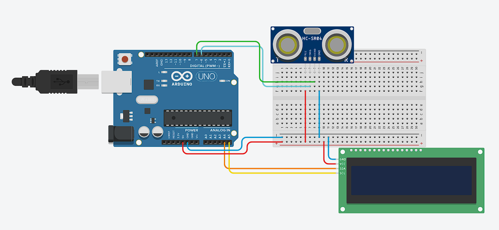

## LCD dan Ultrasonik

**Menampilkan jarak berdasarkan ultrasonik dengan LCD**

* **Rangkaian Arduino**



* **Komponen yang dibutuhkan:**
    * Sensor Ultrasonik HC-SR04 (1 buah)
    * Breadboard (1 buah)
    * Arduino UNO (1 buah)
    * Kabel jumper (Secukupnya)
    * LCD I2C (1 buah)

* **Penjelasan rangkaian:**
    * GND Arduino dihubungkan ke jalur negatif di breadboard
    * 5V Arduino dihubungkan ke jalur positif di breadboard
    * Salah satu jalur negatif breadboard dihubungkan ke pin GND Sensor Ultrasonik
    * Salah satu jalur positif breadboard dihubungkan ke pin VCC Sensor Ultrasonik
    * pin 6 digital pin dihubungkan ke pin TRIG Sensor Ultrasonik
    * pin 7 digital pin dihubungkan ke pin ECHO Sensor Ultrasonik
    * Salah satu jalur negatif breadboard dihubungkan ke pin GND LCD
    * Salah satu jalur positif breadboard dihubungkan ke pin VCC LCD
    * A4 Arduino dihubungkan ke pin SDA LCD
    * A5 Arduino dihubungkan ke pin SCL LCD

* **Program mengukur jarak dengan sensor ultrasonik dan Arduino**
```cpp
    #include <Wire.h>
    // mengimpor library komunikasi I2C, digunakan agar Arduino bisa berkomunikasi dengan modul I2C.
    #include <LiquidCrystal_I2C.h>
    // menggimpor library untuk mempermudah pengendalian LCD dengan modul I2C.
    LiquidCrystal_I2C lcd(0x27, 16, 2);
    /**
    membuat objek lcd dengan:
    - Alamat I2C = 0x27 (alamat bawaan modul I2C, bisa berbeda tergantung modul).
    - 16 kolom × 2 baris LCD.
    **/

    #define TRIG1 6  // digunakan untuk memberi nama alias untuk  digital pin 6 di Arduino
    #define ECHO1 7 // digunakan untuk memberi nama alias untuk  digital pin 7 di Arduino

    long readUltrasonic(int trigPin, int echoPin) {
        digitalWrite(trigPin, LOW); // Sensor berhenti mengirim gelombang ultrasonik
        delayMicroseconds(2); 
        digitalWrite(trigPin, HIGH); // Sensor akan mengirim gelombang ultrasonik
        delayMicroseconds(10); // Memberi pulsa HIGH selama 10 mikrodetik ke pin TRIG 
        digitalWrite(trigPin, LOW); // Sensor berhenti mengirim gelombang ultrasonik
        long duration = pulseIn(echoPin, HIGH, 30000); 
        // mengukur lama waktu (dalam mikrodetik) pin ECHO menerima sinyal HIGH
        long distance = duration * 0.034 / 2;
        /**
            - Kecepatan suara di udara ≈ 0,0343 cm/µs
            - selang * 0.0343 → menghitung jarak total tempuh suara (pergi + pulang)
            - Dibagi 2 → mendapatkan jarak sebenarnya ke objek (hanya satu arah)
        **/

        return distance;
    }


    void setup() {
        lcd.init(); // menginisialisasi LCD agar siap digunakan.
        lcd.backlight(); // menyalakan lampu latar LCD (supaya tulisan terlihat).
        
        Serial.begin(9600); // memulai komunikasi serial

        pinMode(TRIG1, OUTPUT);
        pinMode(ECHO1, INPUT);
        /**
        - pinMode(..., OUTPUT); digunakan untuk memberi tahu Arduino bahwa pin tersebut digunakan 
        untuk keluaran (output), dalam hal ini untuk menyalakan TRIG.
        - pinMode(..., INPUT); digunakan untuk memberi tahu Arduino bahwa pin tersebut digunakan 
        untuk keluaran (intput), dalam hal ini untuk menyalakan ECHO.
        **/
    }

    void loop() {
        long jarak = readUltrasonic(TRIG1, ECHO1); // menyimpan nilai hasil return fungsi readUltrasonic()

        lcd.setCursor(0, 0);  // tulis dibaris pertama
        lcd.print("Jarak:        ");   
        lcd.print(jarak); // tampilkan jarak
        lcd.print(" cm");

        delay(1000); // memberi delay selama 1000 ms
    }
```