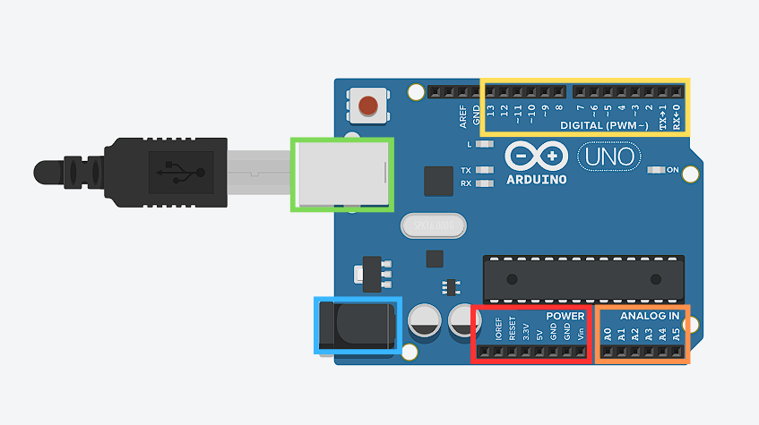
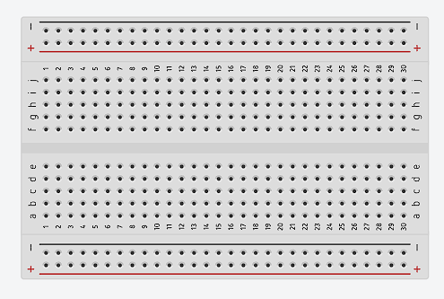
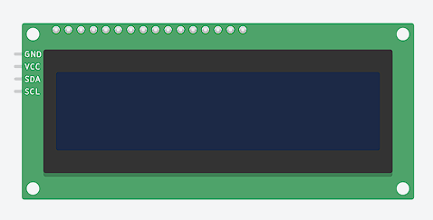
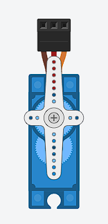
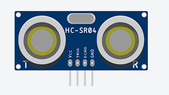

# Komponen Arduino

**1. Arduino Uno R3**

Arduino merupakan sebuah perangkat kreas dan lunak yang bersifat open-source. Arduino sering digunakan untuk merancang dan membuat perangkat elektronik yang salah satunya robot. Pada robot, arduino berperan sebagai otak dari robot mengendalikan sensor, aktuator, serta proses logika yang dibutuhkan.

**2. Breadboard**

Breadboard adalah komponen elekronika yang berbentuk seperti papan yang memiliki banyak lubang. Lubang-lubang tersebut berfungsi untuk menempatkan dan menyusun piranti atau komponen-komponen elektronika menjadi rangkaian elektronika tanpa penyolderan.

**3. Kabel Jumper**

Kabel jumper adalah kabel elektrik yang mempunyai pin konektor disetiap ujungnya dan memungkinkan untuk menghubungkan dua komponen yang melibatkan Arduino tanpa memerlukan solder. Kabel jumper banyak jenisnya, yaitu kabel jumper male to male, male to female dan female to female.

**4. Resistor**

Resistor adalah komponen elektronik yang memiliki dua pin dan didesain untuk mengatur tegangan listrik dan arus listrik, dengan resistansi tertentu (tahanan) dapat memproduksi tegangan listrik di antara kedua pin, nilai tegangan terhadap resistansi berbanding lurus dengan arus yang mengalir.

**5. Servo**

Servo atau motor servo adalah perangkat atau aktuator putar (motor) yang dirancang dengan sistem kontrol feedback loop tertutup (close loop), sehingga dapat memastikan dan menentukan posisi sudut dari poros output motor. Daya yang dimiliki motor servo bervariasi, mulai beberapa watt sampai ratusan watt. Motor servo digunakan untuk berbagai keperluan seperti sistem pelacakan, peralatan mesin dan lain sebagainya. Motor servo dibagi menjadi dua, yaitu motor serco AC dan DC. 

**6. LCD I2C**

LCD I2C adalah salah satu media penampil yang digunakan sebagai interface anatara mikrokontroler dengan USernya. LCD (Liquid Crystal Display) ini sudah dilengkapi dengan interface I2C (Inter-Integrated Circuit) sehingga lebih mudah digunakan dari pada LCD biasa.

**7. Sensor Jarak HC-SR04**

Sensor Jarak HC-SR04 merupakan sensor yang menggunakan gelombang ultrasonik. Gelombang ultrasonik yaitu gelombang yang umum digunakan untuk mendeteksi keberadaan suatu benda dengan memperkirakan jarak antara sensor dan benda tersebut.

---

# Penjelasan Komponen Arduino

**1. Arduino Uno R3**

* **Kotak Merah (Power Pin)**
    * Vin → Input tegangan eksternal (7–12V biasanya).
    * 3.3V → Output tegangan 3.3V.
    * 5V → Output tegangan 5V (banyak dipakai untuk modul).
    * GND → Ground (negatif), ada beberapa pin GND.
    * IOREF → Memberi referensi tegangan untuk mikrokontroler.
    * RESET → Untuk me-reset board (juga bisa disambungkan ke tombol reset eksternal).
* **Kotak Orange (Analog Pins (A0–A5))**
    * Digunakan untuk membaca input analog (sensor).
    * Resolusi ADC (Analog to Digital Converter) = 10-bit (nilai 0–1023).
    * Bisa juga digunakan sebagai digital pin jika dibutuhkan.
* **Kotak Kuning (Digital Pins (0–13))**
    * Pin 0 (RX) dan 1 (TX) → digunakan untuk komunikasi serial (UART).
    * Pin 2–13 → digital input/output.
    * Pin dengan tanda ~ (misalnya 3, 5, 6, 9, 10, 11) → mendukung PWM (Pulse Width Modulation).
* **Kotak Hijau (USB Port)**
     → untuk komunikasi dan suplai daya.
* **Kotak Biru (Jack Barrel)**
     → untuk suplai daya eksternal (7–12V).

**2. Breadboard**

* **Tanda plus (+)**
    * Biasanya digunakan sebagai rail positif.
    * Jalur ini kemudian dihubungkan ke pin VCC Arduino (5V atau 3.3V).
    * Dengan begitu, jalur + di breadboard bisa dipakai untuk membagikan tegangan ke banyak sensor atau modul sekaligus, tanpa harus mencolok langsung ke pin VCC Arduino berkali-kali.
* **Tanda min (-)**
    * Biasanya digunakan sebagai rail negatif.
    * Jalur ini dihubungkan ke pin GND Arduino.
    * Dengan begitu, jalur – di breadboard bisa dipakai untuk membagikan ground ke banyak sensor atau modul sekaligus.

**3. LCD I2C**

* **Pin VCC → Untuk memberi daya (biasanya 5V dari Arduino).**
* **Pin GND → Ground (harus disambungkan ke GND Arduino).**
* **SDA (Serial Data) → Jalur data untuk komunikasi I²C dan dihubungkan ke pin A4 di Arduino.**
* **SCL (Serial Clock) → Jalur clock untuk komunikasi I²C dan dihubungkan ke pin A5 di Arduino.**

**4. Servo**

* **Kabel Coklat / Hitam → GND (Ground)**
    * Kabel ini dihubungkan ke GND Arduino atau power supply.
    * Fungsinya sebagai jalur negatif / referensi tegangan.
* **Kabel Merah (VCC)**
    * Kabel ini dihubungkan ke VCC Arduino atau power supply.
    * Fungsinya sebagai jalur positif
* **Kabel Oren (Signal Pin)**
    * Kabel ini menerima sinyal PWM (Pulse Width Modulation) dari Arduino.
    * Pin ini dihubungkan ke digital pin Arduino (misalnya D9, D10, atau pin lain yang bisa output PWM).
    * Sinyal PWM ini yang menentukan sudut putaran servo.

**5. Ultrasonik HC-SR04**

* **Pin VCC → Untuk memberi daya (biasanya 5V dari Arduino).**
* **Pin GND → Ground (harus disambungkan ke GND Arduino).**
* **TRIG**
    * Pin input dari Arduino.
    * Arduino memberi pulsa HIGH singkat (10 µs) ke pin ini untuk memicu sensor mengirim gelombang ultrasonik.
* **ECHO**
    * Pin output dari sensor ke Arduino.
    * Sensor akan memberi sinyal HIGH selama gelombang ultrasonik berjalan ke objek dan kembali lagi (pantulan).
    * Lama durasi HIGH inilah yang dipakai Arduino untuk menghitung jarak.