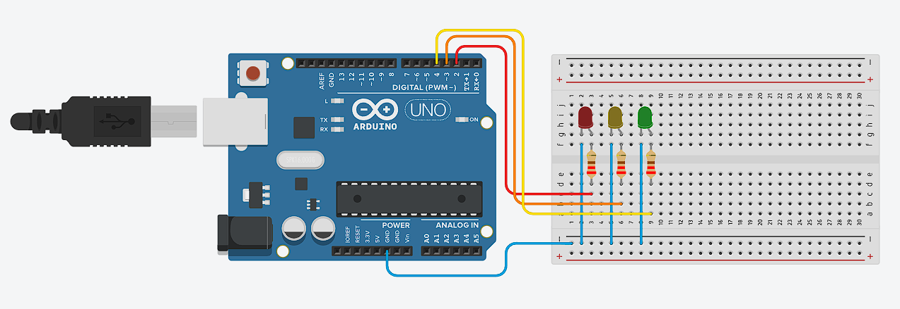

## Syntax Dasar Arduino

**Kode program yang akan tampil ketika baru membuka Arduino IDE:**
```cpp
    void setup() {
    // put your setup code here, to run once:

    }

    void loop() {
    // put your main code here, to run repeatedly:

    }
```

**Penjelasan Sintaks:**

* `void setup(){}`: merupakan tempat tempat inisialisasi yang hanya dijalankan satu kali ketika Arduino pertama kali dinyalakan atau setelah di-reset.
    * Menyetel mode pin (input/output) dengan pinMode().
    * Menginisialisasi komunikasi serial (Serial.begin()).
    * Menginisialisasi sensor, LCD, atau modul lainnya.
* `void loop(){}`: merupakan blok kode utama yang akan dijalankan berulang-ulang selama Arduino menyala. Fungsi ini mirip dengan “program utama” yang terus berjalan secara infinite loop. Biasanya digunakan untuk:
    * Membaca data sensor.
    * Memberikan logika perhitungan atau pengambilan keputusan.
    * Mengontrol aktuator seperti LED, motor, buzzer, dsb.
    * Mengirim/menampilkan data ke serial monitor atau LCD.

---
**Contoh projek menyalakan LED dengan arduino:**

* **Rangkaian Arduino**



* **Komponen yang dibutuhkan:**
    * Lampu LED (3 buah)
    * Arduino UNO (1 buah)
    * Breadboard (1 buah)
    * Resistor 220 Ohm (3 buah)
    * Kabel jumper (Secukupnya)

* **Penjelasan rangkaian:**
    * GND Arduino dihubungkan ke jalur negatif di breadboard
    * Kaki LED yang lebih pendek (katoda) dihubungkan ke jalur negatif di breadboard
    * Digital pins pada Arduino (2, 3, 4) dihubungkan ke beradboard seperti pada gambar
    * Kaki LED yang lebih panjang (anoda) dihubungkan ke pin digital yang sudah terhubung pada breadboard melalui resistor

* **Program menyalakan LED dengan arduino**
```cpp
    #define LED1 2 // digunakan untuk memberi nama alias untuk pin 2 di Arduino
    #define LED2 3 // digunakan untuk memberi nama alias untuk pin 3 di Arduino
    #define LED3 4 // digunakan untuk memberi nama alias untuk pin 4 di Arduino

    void setup(){
        pinMode(LED1, OUTPUT);
        pinMode(LED2, OUTPUT);
        pinMode(LED3, OUTPUT);
        /**
        pinMode(..., OUTOUT); digunakan untuk memberi tahu Arduino bahwa pin tersebut digunakan 
        untuk keluaran (output), dalam hal ini untuk menyalakan LED.
        **/
       
        Serial.begin(9600);
        // memulai komunikasi serial dengan kecepatan 9600 bps, biasanya untuk debugging
    }

    void loop(){
        digitalWrite(LED1, HIGH); // digunakan untuk menyalakan LED1 (HIGH artinya menyala)
        delay(500); // memberi jeda selama 500 ms
        digitalWrite(LED1, LOW); // digunakan untuk mematikan LED1 (HIGH artinya mati)
        digitalWrite(LED2, HIGH);
        delay(500); 
        digitalWrite(LED2, LOW);
        digitalWrite(LED3, HIGH);
        delay(500);
        digitalWrite(LED3, LOW);
    }
```