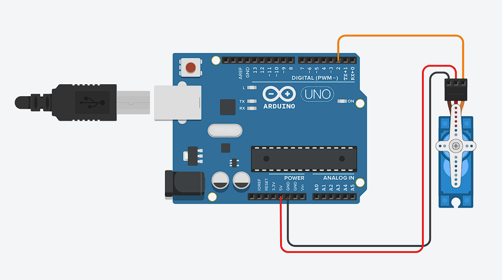

## Servo/Motor Servo

**Menggerakan servo dengan Arduino**

* **Rangkaian Arduino**



* **Komponen yang dibutuhkan:**
    * Servo (1 buah)
    * Arduino UNO (1 buah)
    * Kabel jumper (Secukupnya)

* **Penjelasan rangkaian:**
    * GND Arduino dihubungkan ke pin Ground Servo (kabel hitam/coklat)
    * 5V Arduino dihubungkan ke pin Power Servo (kabel merah)
    * Digital pins 2 pada Arduino dihubungkan ke Signal Servo (kabel orange)

* **Program menyalakan Servo dengan Arduino**
```cpp
    #include <Servo.h> 
    Servo servo; 

    #define SERVO1 2 

    void setup(){
        servo.attach(SERVO1); 
        Serial.begin(9600); 
    }

    void loop(){
        for(int pos = 0; pos <= 180; pos++){
            servo.write(pos); 
            delay(50); 
        }
    
        delay(500); 

        for(int pos = 180; pos >= 0; pos--){
            servo.write(pos); 
            delay(50); 
        }
    }
```
