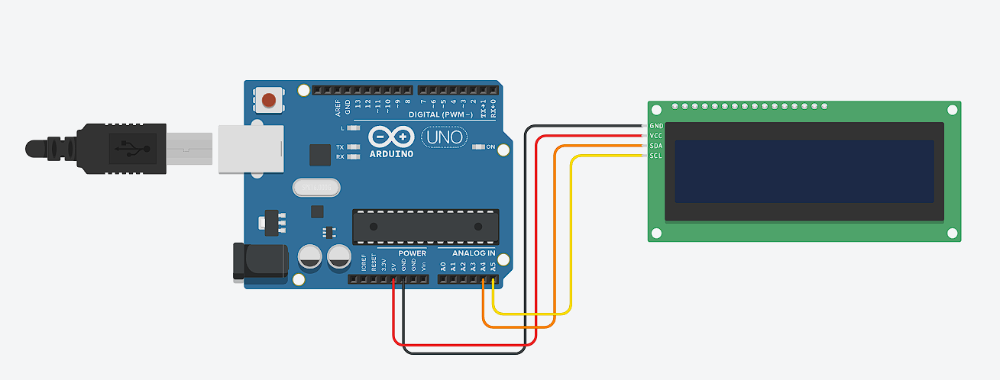

## LCD I2C

**Menampilkan teks pada LCD I2C dengan Arduino**

* **Rangkaian Arduino**



* **Komponen yang dibutuhkan:**
    * LCD I2C (1 buah)
    * Arduino UNO (1 buah)
    * Kabel jumper (Secukupnya)

* **Penjelasan rangkaian:**
    * GND Arduino dihubungkan ke pin GND LCD
    * 5V Arduino dihubungkan ke pin VCC LCD
    * A4 Arduino dihubungkan ke pin SDA LCD
    * A5 Arduino dihubungkan ke pin SCL LCD

* **Program menyalakan Servo dengan Arduino**
```cpp
    #include <Wire.h> 
    // mengimpor library komunikasi I2C, digunakan agar Arduino bisa berkomunikasi dengan modul I2C.
    #include <LiquidCrystal_I2C.h>
    // menggimpor library untuk mempermudah pengendalian LCD dengan modul I2C.
    LiquidCrystal_I2C lcd(0x27, 16, 2);  
    /**
    membuat objek lcd dengan:
    - Alamat I2C = 0x27 (alamat bawaan modul I2C, bisa berbeda tergantung modul).
    - 16 kolom × 2 baris LCD.
    **/

    void setup(){
        lcd.init(); // menginisialisasi LCD agar siap digunakan.
    
        lcd.backlight(); // menyalakan lampu latar LCD (supaya tulisan terlihat).
        
        // Tampilkan teks di baris pertama
        lcd.setCursor(4, 0); // Atur kursor ke kolom 4, baris 0 (baris pertama)
        lcd.print(" OPREC"); // menampilkan teks " OPREC" mulai dari posisi tersebut
        
        // Tampilkan teks di baris kedua
        lcd.setCursor(2, 1); // Atur kursor ke kolom 2, baris 1 (baris kedua)
        lcd.print("ROBOTIKA UNS"); // menampilkan teks "ROBOTIKA UNS" di baris kedua
    }

    void loop(){
        /**
         loop kosong artinya LCD hanya menampilkan tulisan sekali di awal (setup()), lalu tidak ada perubahan setelah itu
        **/
    }
```