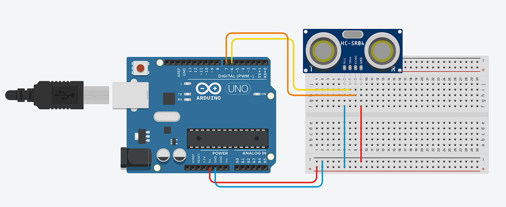

## Sensor Ultrasonik HR-SR04

**Mengukur jarak dengan sensor ultrasonik dan Arduino**

* **Rangkaian Arduino**



* **Komponen yang dibutuhkan:**
    * Sensor Ultrasonik HC-SR04 (1 buah)
    * Breadboard (1 buah)
    * Arduino UNO (1 buah)
    * Kabel jumper (Secukupnya)

* **Penjelasan rangkaian:**
    * GND Arduino dihubungkan ke jalur negatif di breadboard
    * 5V Arduino dihubungkan ke jalur positif di breadboard
    * Salah satu jalur negatif breadboard dihubungkan ke pin GND Sensor Ultrasonik
    * Salah satu jalur positif breadboard dihubungkan ke pin VCC Sensor Ultrasonik
    * pin 6 digital pin dihubungkan ke pin TRIG Sensor Ultrasonik
    * pin 7 digital pin dihubungkan ke pin ECHO Sensor Ultrasonik

* **Program mengukur jarak dengan sensor ultrasonik dan Arduino**
```cpp
    #define TRIG1 6 
    #define ECHO1 7 

    void setup(){
        pinMode(TRIG1, OUTPUT);
        pinMode(ECHO1, INPUT);
        
        Serial.begin(9600); 
    }

    void loop(){
        digitalWrite(TRIG1, HIGH); 
        delayMicroseconds(10); 
        digitalWrite(TRIG1, LOW); 
    
        double selang = pulseIn(ECHO1, HIGH); 

        double jarak = (selang * 0.0343) / 2.0;

        Serial.print("Jarak: "); Serial.print(jarak); Serial.println("cm");

        delay(1000); 
    }
```