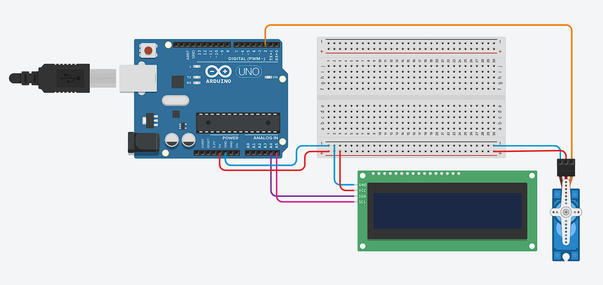

## Servo dan LCD

**Menggerakan servo dan menampilkan sudutnya di LCD**

* **Rangkaian Arduino**



* **Komponen yang dibutuhkan:**
    * LCD I2C (1 buah)
    * Breadboard (1 buah)
    * Arduino UNO (1 buah)
    * Kabel jumper (Secukupnya)
    * Servo (1 buah)

* **Penjelasan rangkaian:**
    * GND Arduino dihubungkan ke jalur negatif di breadboard
    * 5V Arduino dihubungkan ke jalur positif di breadboard
    * Salah satu jalur negatif breadboard dihubungkan ke pin GND LCD
    * Salah satu jalur positif breadboard dihubungkan ke pin VCC LCD
    * A4 Arduino dihubungkan ke pin SDA LCD
    * A5 Arduino dihubungkan ke pin SCL LCD
    * Salah satu jalur negatif breadboard dihubungkan ke pin Ground Servo1 (kabel hitam)
    * Salah satu jalur positif breadboard dihubungkan ke pin Power Servo1 (kabel merah)
    * Digital pins 2 pada Arduino dihubungkan ke Signal Servo (kabel orange)

* **Program mengukur jarak dengan sensor ultrasonik dan Arduino**
```cpp
    #include <Wire.h>
    #include <LiquidCrystal_I2C.h>
    #include <Servo.h> 
    LiquidCrystal_I2C lcd(0x27, 16, 2);

    #define SERVO 2 
    Servo servo; 


    void setup() {
        lcd.init(); 
        lcd.backlight(); 

        servo.attach(SERVO); 
    }

    void loop() {
        for(int pos = 0; pos <= 180; pos++){
            servo.write(pos); 
            lcd.setCursor(0, 0); 
            lcd.print("Servo (derajat): ");  
            lcd.setCursor(0, 1);
            lcd.print("     ");   
            lcd.setCursor(0, 1); 
            lcd.print(pos);  
            delay(10); 
        }
        
        delay(500); 
        
        for(int pos = 180; pos >= 0; pos--){
            servo.write(pos); 
            lcd.setCursor(0, 0); 
            lcd.print("Servo (derajat): ");  
            lcd.setCursor(0, 1);
            lcd.print("     ");    
            lcd.setCursor(0, 1); 
            lcd.print(pos);  
            delay(10); 
        }
    }
```