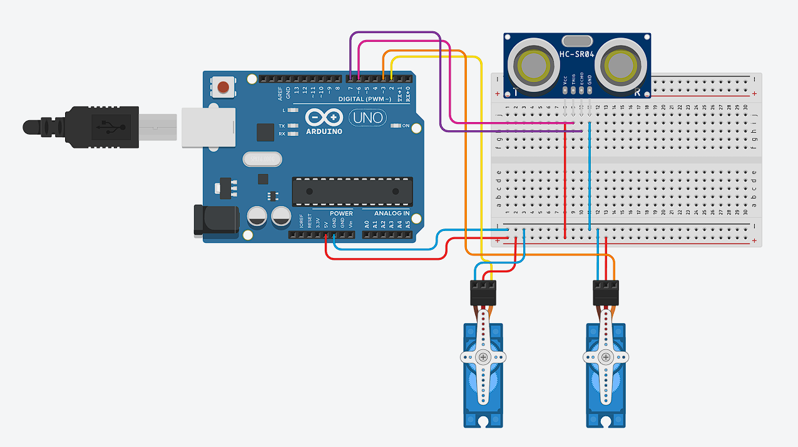

## Servo dan Ultrasonik

**Menggerakan servo berdasarkan ultrasonik**

* **Rangkaian Arduino**



* **Komponen yang dibutuhkan:**
    * Sensor Ultrasonik HC-SR04 (1 buah)
    * Breadboard (1 buah)
    * Arduino UNO (1 buah)
    * Kabel jumper (Secukupnya)
    * Servo (2 buah)

* **Penjelasan rangkaian:**
    * GND Arduino dihubungkan ke jalur negatif di breadboard
    * 5V Arduino dihubungkan ke jalur positif di breadboard
    * Salah satu jalur negatif breadboard dihubungkan ke pin GND Sensor Ultrasonik
    * Salah satu jalur positif breadboard dihubungkan ke pin VCC Sensor Ultrasonik
    * pin 6 digital pin dihubungkan ke pin TRIG Sensor Ultrasonik
    * pin 7 digital pin dihubungkan ke pin ECHO Sensor Ultrasonik
    * Salah satu jalur negatif breadboard dihubungkan ke pin Ground Servo1 (kabel hitam)
    * Salah satu jalur positif breadboard dihubungkan ke pin Power Servo1 (kabel merah)
    * Digital pins 2 pada Arduino dihubungkan ke Signal Servo (kabel orange)
    * Salah satu jalur negatif breadboard dihubungkan ke pin Ground Servo2 (kabel hitam)
    * Salah satu jalur positif breadboard dihubungkan ke pin Power Servo2 (kabel merah)
    * Digital pins 3 pada Arduino dihubungkan ke Signal Servo (kabel orange)

* **Program mengukur jarak dengan sensor ultrasonik dan Arduino**
```cpp
    #include <Servo.h> // mengimpor library bawaan Arduino untuk mengontrol motor servo
    #define SERVO1 2 // digunakan untuk memberi nama alias untuk pin digital 2 di Arduino
    #define SERVO2 3 // digunakan untuk memberi nama alias untuk pin digital 3 di Arduino
    #define TRIG 6 // digunakan untuk memberi nama alias untuk  digital pin 6 di Arduino
    #define ECHO 7 // digunakan untuk memberi nama alias untuk  digital pin 7 di Arduino

    Servo myServo1; // membuat sebuah objek bernama myServo1 yang akan dipakai untuk mengendalikan servo
    Servo myServo2; // membuat sebuah objek bernama myServo2 yang akan dipakai untuk mengendalikan servo

    long readUltrasonic(int trigPin, int echoPin) {
        digitalWrite(trigPin, LOW); // Sensor berhenti mengirim gelombang ultrasonik
        delayMicroseconds(2); 
        digitalWrite(trigPin, HIGH); // Sensor akan mengirim gelombang ultrasonik
        delayMicroseconds(10); // Memberi pulsa HIGH selama 10 mikrodetik ke pin TRIG 
        digitalWrite(trigPin, LOW); // Sensor berhenti mengirim gelombang ultrasonik
        long duration = pulseIn(echoPin, HIGH, 30000); 
        // mengukur lama waktu (dalam mikrodetik) pin ECHO menerima sinyal HIGH
        long distance = duration * 0.034 / 2;
        /**
            - Kecepatan suara di udara ≈ 0,0343 cm/µs
            - selang * 0.0343 → menghitung jarak total tempuh suara (pergi + pulang)
            - Dibagi 2 → mendapatkan jarak sebenarnya ke objek (hanya satu arah)
        **/

        return distance;
    }

    void setup() {
        pinMode(TRIG, OUTPUT);
        pinMode(ECHO, INPUT);
        /**
        - pinMode(..., OUTPUT); digunakan untuk memberi tahu Arduino bahwa pin tersebut digunakan 
        untuk keluaran (output), dalam hal ini untuk menyalakan TRIG.
        - pinMode(..., INPUT); digunakan untuk memberi tahu Arduino bahwa pin tersebut digunakan 
        untuk keluaran (intput), dalam hal ini untuk menyalakan ECHO.
        **/

        myServo1.attach(SERVO1); // menghubungkan objek servo dengan digital pin 2. Artinya, motor servo bisa dikontrol 
        myServo2.attach(SERVO2); // menghubungkan objek servo dengan digital pin 3. Artinya, motor servo bisa dikontrol 
            
        Serial.begin(9600);
    }

    void loop() {
        long jarak = readUltrasonic(TRIG, ECHO); // menyimpan nilai hasil return fungsi readUltrasonic()
        if(jarak < 50) {
            // loop pertama memutar servo dari sudut 0 derajat sampai 180 derajat
            for(int pos = 0; pos < 180; pos++){
                myServo1.write(pos); // mengatur posisi myServo1 ke sudut pos
                myServo2.write(pos); // mengatur posisi myServo2 ke sudut pos
                delay(50); // memberi delay selama 50 ms
            }
            
            delay(5000);// memberi delay selama 5000 ms

            // loop kedua memutar servo dari sudut 0 derajat sampai 180 derajat
            for(int pos = 180; pos <= 0; pos--){
                myServo1.write(pos);  // mengatur posisi myServo1 ke sudut pos
                myServo2.write(pos);  // mengatur posisi myServo2 ke sudut pos
                delay(50);  // memberi delay selama 50 ms
            }
        }
    }
```