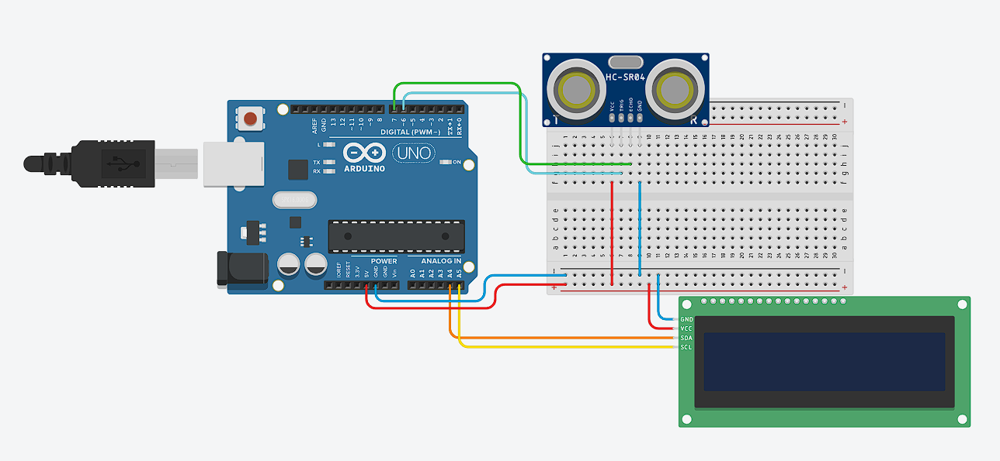

## LCD dan Ultrasonik

**Menampilkan jarak berdasarkan ultrasonik dengan LCD**

* **Rangkaian Arduino**



* **Komponen yang dibutuhkan:**
    * Sensor Ultrasonik HC-SR04 (1 buah)
    * Breadboard (1 buah)
    * Arduino UNO (1 buah)
    * Kabel jumper (Secukupnya)
    * LCD I2C (1 buah)

* **Penjelasan rangkaian:**
    * GND Arduino dihubungkan ke jalur negatif di breadboard
    * 5V Arduino dihubungkan ke jalur positif di breadboard
    * Salah satu jalur negatif breadboard dihubungkan ke pin GND Sensor Ultrasonik
    * Salah satu jalur positif breadboard dihubungkan ke pin VCC Sensor Ultrasonik
    * pin 6 digital pin dihubungkan ke pin TRIG Sensor Ultrasonik
    * pin 7 digital pin dihubungkan ke pin ECHO Sensor Ultrasonik
    * Salah satu jalur negatif breadboard dihubungkan ke pin GND LCD
    * Salah satu jalur positif breadboard dihubungkan ke pin VCC LCD
    * A4 Arduino dihubungkan ke pin SDA LCD
    * A5 Arduino dihubungkan ke pin SCL LCD

* **Program mengukur jarak dengan sensor ultrasonik dan Arduino**
```cpp
    #include <Wire.h>
    #include <LiquidCrystal_I2C.h>
    LiquidCrystal_I2C lcd(0x27, 16, 2);

    #define TRIG1 6 
    #define ECHO1 7 

    long readUltrasonic(int trigPin, int echoPin) {
        digitalWrite(trigPin, LOW); 
        delayMicroseconds(2); 
        digitalWrite(trigPin, HIGH); 
        delayMicroseconds(10); 
        digitalWrite(trigPin, LOW); 
        long duration = pulseIn(echoPin, HIGH, 30000); 
        long distance = duration * 0.034 / 2;

        return distance;
    }


    void setup() {
        lcd.init(); 
        lcd.backlight(); 
        
        Serial.begin(9600); 

        pinMode(TRIG1, OUTPUT);
        pinMode(ECHO1, INPUT);
    }

    void loop() {
        long jarak = readUltrasonic(TRIG1, ECHO1); 

        lcd.setCursor(0, 0);  
        lcd.print("Jarak:        ");   
        lcd.print(jarak); 
        lcd.print(" cm");

        delay(1000); 
    }
```