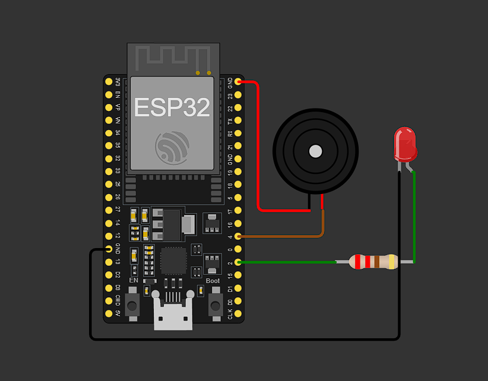
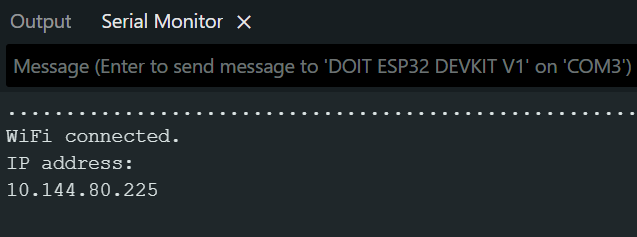
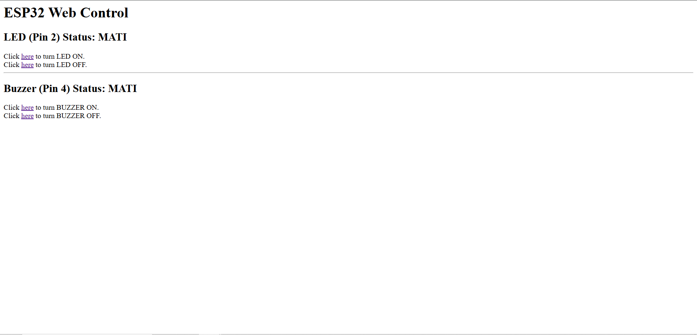

## ESP32 WiFi Communication

** Menghubungkan ESP32 dengan laptop melalui hospot HP **

* **Rangkaian ESP32**



* **Komponen yang dibutuhkan:**
    * LED (1 buah)
    * Buzzer (1 buah)
    * ESP32 (1 buah)
    * Kabel jumper (Secukupnya)
    * Resistor 220 Ohm (1 buah)

* **Penjelasan rangkaian:**
    * GND ESP32  yang disebelah kanan (kabel hitam) dihubungkan ke kaki LED yang lebih pendek
    * PIN GPIO 2 dihubungkan ke resistor 220 ohm lalu dihubungkan ke kaki LED yang lebih panjang
    * GNP ESP 32 yang disebelah kiri (kabel merah) dihubungkan ke kaki BUZZER yang lebih pendek
    * PIN GPIO 4 dihubungkan ke resistor 220 ohm lalu dihubungkan ke kaki BUZZER yang lebih panjang

* **  Hal - hal yang perlu diperhatikan saat ingin mengubungkan ESP32 ke WiFI: **
    * Jika setelah upload kode program ke ESP32 selesai dan ESP32 tidak bisa terhubung, ulangi upload sambil menekan tombol BOOT/RESET sampai kode program selesai dicompile
    * Pastika ESP32 dan Laptop terhubung dengan WiFi atau hospot yang sama
    * Untuk mempercepat koneksi, password hospot/WiFi bisa diset menjadi tidak ada

* **Program menyenghubungkan ESP32 dengan Laptop**
```cpp
   /*
     WiFi Web Server LED & Buzzer Control

     Perintah Kontrol:
     http://[Alamat_IP]/L1   -> LED NYALA
     http://[Alamat_IP]/L0   -> LED MATI
     http://[Alamat_IP]/B1   -> BUZZER NYALA
     http://[Alamat_IP]/B0   -> BUZZER MATI
     */

    #include <WiFi.h>                       // Digunakan untuk mengaktifkan fungsi WiFi pada ESP32

    const char *ssid = "Qiqiw";           // Menentukan nama (SSID) jaringan WiFi Hotspot yang akan dihubungkan
    const char *password = "";            // Password jaringan WiFi, diatur kosong karena hotspot tidak memiliki password

    const int ledPin = 2;                // Menentukan alias untuk GPIO 2, digunakan untuk LED
    const int buzzerPin = 4;             // Menentukan alias untuk GPIO 4, digunakan untuk Buzzer

    NetworkServer server(80);             // Membuat objek server yang mendengarkan permintaan pada port HTTP standar (80)

    void setup() {
      Serial.begin(115200);               // Memulai komunikasi serial dengan kecepatan 115200 bps (untuk debugging di Serial Monitor)
      pinMode(2, OUTPUT);                 // Mengatur pin GPIO 2 (LED) sebagai output
      pinMode(4, OUTPUT);                 // Mengatur pin GPIO 4 (Buzzer) sebagai output
      
      delay(10);                          // Memberi jeda singkat selama 10 ms

      // Memulai koneksi ke jaringan WiFi Hotspot
      Serial.println();                   // Mencetak baris kosong
      Serial.println();                   // Mencetak baris kosong
      Serial.print("Connecting to ");     // Mencetak pesan awal
      Serial.println(ssid);               // Mencetak nama SSID

      WiFi.begin(ssid, password);         // Memulai proses koneksi WiFi dengan SSID dan Password yang ditentukan

      while (WiFi.status() != WL_CONNECTED) { // Loop selama ESP32 belum terhubung ke WiFi
        delay(500);                      // Memberi jeda 500 ms
        Serial.print(".");                // Mencetak titik untuk indikasi proses
      }

      Serial.println("");                 // Mencetak baris baru
      Serial.println("WiFi connected.");  // Mencetak status koneksi berhasil
      Serial.println("IP address: ");     // Mencetak label alamat IP
      Serial.println(WiFi.localIP());     // Mencetak alamat IP yang didapatkan oleh ESP32

      server.begin();                     // Memulai Web Server agar siap menerima koneksi
    }

    void loop() {
      NetworkClient client = server.accept();  // Menerima klien (perangkat) yang mencoba terhubung ke server

      if (client) {                      // Jika ada klien baru yang terhubung, lanjutkan
        Serial.println("New Client.");    // Mencetak pesan klien baru di Serial Monitor
        String currentLine = "";          // Membuat variabel string untuk menyimpan baris data HTTP yang masuk
        while (client.connected()) {      // Loop selama klien masih terhubung
          if (client.available()) {       // Jika ada byte data yang tersedia dari klien,
            char c = client.read();       // Membaca satu byte karakter dari klien
            Serial.write(c);              // Menampilkan karakter tersebut di Serial Monitor (untuk melihat permintaan HTTP)
            if (c == '\n') {              // Jika karakter adalah newline (akhir baris)

              // Jika baris saat ini kosong, itu menandakan akhir dari header permintaan HTTP:
              if (currentLine.length() == 0) {
                // Mengirim header respons HTTP ke klien (browser)
                client.println("HTTP/1.1 200 OK");
                client.println("Content-type:text/html");
                client.println(); // Baris kosong untuk mengakhiri header

                // Isi (konten HTML) dari respons HTTP dikirim setelah header:
                client.print("<h1>ESP32 Web Control</h1>"); // Judul utama

                // Kontrol LED (Pin 2)
                client.print("<h2>LED (Pin 2) Status: ");
                client.print(digitalRead(ledPin) == HIGH ? "NYALA" : "MATI"); // Menampilkan status saat ini
                client.print("</h2>");
                client.print("Click <a href=\"/L1\">here</a> to turn LED ON.<br>"); // Link untuk menyalakan LED (perintah /L1)
                client.print("Click <a href=\"/L0\">here</a> to turn LED OFF.<br>"); // Link untuk mematikan LED (perintah /L0)
                
                client.print("<hr>"); // Garis pemisah

                // Kontrol Buzzer (Pin 4)
                client.print("<h2>Buzzer (Pin 4) Status: ");
                client.print(digitalRead(buzzerPin) == HIGH ? "NYALA" : "MATI"); // Menampilkan status saat ini
                client.print("</h2>");
                client.print("Click <a href=\"/B1\">here</a> to turn BUZZER ON.<br>"); // Link untuk menyalakan Buzzer (perintah /B1)
                client.print("Click <a href=\"/B0\">here</a> to turn BUZZER OFF.<br>"); // Link untuk mematikan Buzzer (perintah /B0)

                // Respons HTTP diakhiri dengan baris kosong tambahan:
                client.println();
                break; // Keluar dari loop klien karena respons sudah dikirim
              } else {  // Jika ini adalah baris header HTTP lainnya,
                currentLine = "";  // Reset variabel untuk membaca baris berikutnya
              }
            } else if (c != '\r') {  // Jika bukan carriage return ('\r'),
              currentLine += c;      // Tambahkan karakter ke baris saat ini (currentLine)
            }

            // LOGIKA PENGENDALIAN PIN: Cek apakah baris permintaan HTTP berakhir dengan perintah yang dikenal
            
            // Kontrol LED (Pin 2)
            if (currentLine.endsWith("GET /L1")) {     // Jika permintaan adalah untuk /L1
              digitalWrite(ledPin, HIGH);            // Nyalakan LED (HIGH)
            }
            if (currentLine.endsWith("GET /L0")) {     // Jika permintaan adalah untuk /L0
              digitalWrite(ledPin, LOW);             // Matikan LED (LOW)
            }

            // Kontrol BUZZER (Pin 4)
            if (currentLine.endsWith("GET /B1")) {     // Jika permintaan adalah untuk /B1
              digitalWrite(buzzerPin, HIGH);         // Nyalakan Buzzer (HIGH)
            }
            if (currentLine.endsWith("GET /B0")) {     // Jika permintaan adalah untuk /B0
              digitalWrite(buzzerPin, LOW);          // Matikan Buzzer (LOW)
            }
          }
        }
        // close the connection:
        client.stop();                     // Tutup koneksi klien setelah selesai merespons
        Serial.println("Client Disconnected."); // Mencetak pesan pemutusan koneksi
      }
    }
```
* **Setelah program berjalan dan berhasil terhubung dengan Hospot/WiFI serial monitor akan menampilkan seperti ini**



* **Tampilan Web setalh mengakses IP Address**



* **Link Video Demo**
Link: [Demo menyalakan dan mematikan LED dan BUZZER](https://drive.google.com/file/d/1HrKWkE8_ab_ObEbc0yJgyUJ3moa0DMQD/view?usp=drive_link)