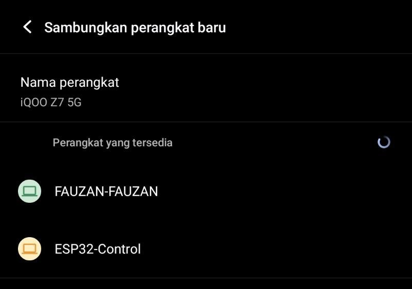

## ESP32 Bluetooth Communication

**Menghubungkan ESP32 dengan HP melalui Bluetooth**

* **Rangkaian ESP32**


* **Komponen yang dibutuhkan:**
    * LED (1 buah)
    * Buzzer (1 buah)
    * ESP32 (1 buah)
    * Kabel jumper (Secukupnya)
    * Resistor 220 Ohm (1 buah)

* **Penjelasan rangkaian:**
    * GND ESP32  yang disebelah kanan (kabel hitam) dihubungkan ke kaki LED yang lebih pendek
    * PIN GPIO 2 dihubungkan ke resistor 220 ohm lalu dihubungkan ke kaki LED yang lebih panjang
    * GNP ESP 32 yang disebelah kiri (kabel merah) dihubungkan ke kaki BUZZER yang lebih pendek
    * PIN GPIO 4 dihubungkan ke resistor 220 ohm lalu dihubungkan ke kaki BUZZER yang lebih panjang

* **Hal - hal yang perlu diperhatikan saat ingin mengubungkan ESP32 ke Bluetooth:**
    * Jika ESP32 tidak bisa terhubung setelah upload berhasil, Anda cukup menekan tombol RESET (EN) sekali pada papan ESP32. Ini akan me-restart program dan memicu ESP32 mencoba koneksi Wi-Fi lag
    * Laptop dan ESP32 hanya perlu mengaktifkan Bluetooth dan melakukan pairing.
    * Untuk HP, perlu menggunakan aplikasi Terminal Bluetooth yang sudah dirancang khusus untuk ini. Aplikasi ini secara otomatis menangani koneksi Bluetooth Serial (SPP) tanpa perlu mengetahui nomor COM Port

* **Program menghubungkan ESP32 dengan Laptop**
```cpp
    #include "BluetoothSerial.h" // Mengimpor library utama untuk mengaktifkan fungsi Bluetooth Serial Port Profile (SPP) pada ESP32.

    #if !defined(CONFIG_BT_ENABLED) || !defined(CONFIG_BLUEDROID_ENABLED)
    #error Bluetooth is not enabled! Please run 'make menuconfig' to enable it.
    #endif
    // Cek kondisi pre-processor untuk memastikan dukungan Bluetooth diaktifkan dalam pengaturan ESP32. Jika tidak, akan muncul error.

    const int ledPin = 2;   // LED di GPIO 2
    const int buzzerPin = 4; // Buzzer di GPIO 4

    BluetoothSerial SerialBT; // Membuat objek (instance) dari kelas BluetoothSerial dengan nama SerialBT. Objek inilah yang akan digunakan untuk mengirim dan menerima data via Bluetooth.

    void setup() {
    Serial.begin(115200); // Menginisialisasi komunikasi Serial USB pada baud rate 115200. Ini digunakan untuk debugging via Serial Monitor di laptop.
    pinMode(ledPin, OUTPUT); // Mengatur pin GPIO 2 (LED) sebagai mode OUTPUT
    pinMode(buzzerPin, OUTPUT); // Mengatur pin GPIO 4 (Buzzer) sebagai mode OUTPUT
    
    digitalWrite(ledPin, LOW); // Memastikan LED dalam keadaan MATI (LOW/0V) saat pertama kali setup.
    digitalWrite(buzzerPin, LOW); // Memastikan Buzzer dalam keadaan MATI (LOW/0V) saat pertama kali setup.

    SerialBT.begin("ESP32-Control"); // Memulai layanan Bluetooth Serial dan mengatur nama perangkat Bluetooth menjadi "ESP32-Control", agar bisa ditemukan dan di-pairing oleh HP/Laptop.
    Serial.println("Bluetooth sudah siap"); // Mencetak pesan ke Serial Monitor USB (debugging) untuk mengonfirmasi bahwa Bluetooth sudah siap.
    }

    void loop() {
    if (SerialBT.available()) { // Memeriksa apakah ada data baru yang masuk dari perangkat yang terhubung melalui Bluetooth.
        String command = SerialBT.readStringUntil('\n'); // Membaca semua data yang masuk dari Bluetooth dan menyimpannya ke variabel command sebagai String, hingga menemukan karakter newline
        command.trim(); // Menghapus spasi atau karakter tidak penting di awal atau akhir String command

        Serial.print("Perintah diterima: ");
        Serial.println(command);
        
        if (command == "L1") {
        digitalWrite(ledPin, HIGH); // Menyalakan LED (mengatur GPIO 2 ke HIGH).
        SerialBT.println("LED ON"); // Mematikan LED (mengatur GPIO 2 ke LOW).
        } else if (command == "L0") {
        digitalWrite(ledPin, LOW);
        SerialBT.println("LED OFF");
        } else if (command == "B1") {
        digitalWrite(buzzerPin, HIGH); // Menyalakan BUZZER (mengatur GPIO 4 ke HIGH).
        SerialBT.println("BUZZER ON");
        } else if (command == "B0") {
        digitalWrite(buzzerPin, LOW); // Mematikan BUZZER (mengatur GPIO 4 ke LOW).
        SerialBT.println("BUZZER OFF");
        } else {
        SerialBT.println("Perintah tidak valid.");
        }
    }
    delay(20); // Memberi jeda waktu 20 ms
    }
```
* **Setelah program berjalan dan berhasil terhubung akan muncul "ESP32-Control di Bluetooth HP"**



* **Jika sudah tersambung tampilannya seperti ini:**


* **Link Video Demo** : [Demo menyalakan dan mematikan LED dan BUZZER Bluetooth](https://drive.google.com/file/d/1pPSyT8Zo8rKYjS92qBTHgM3eCB9JhW83/view?usp=drive_link)
