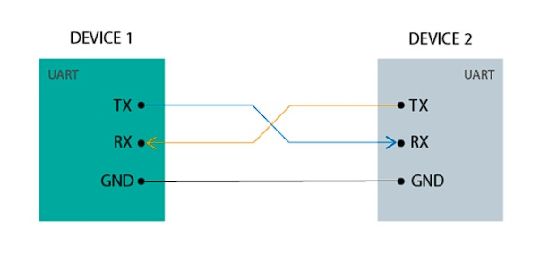
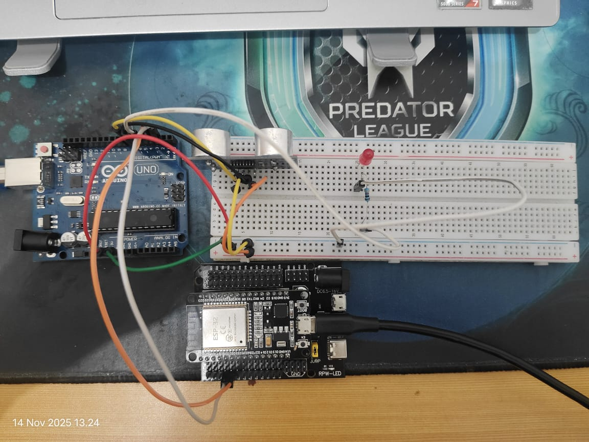
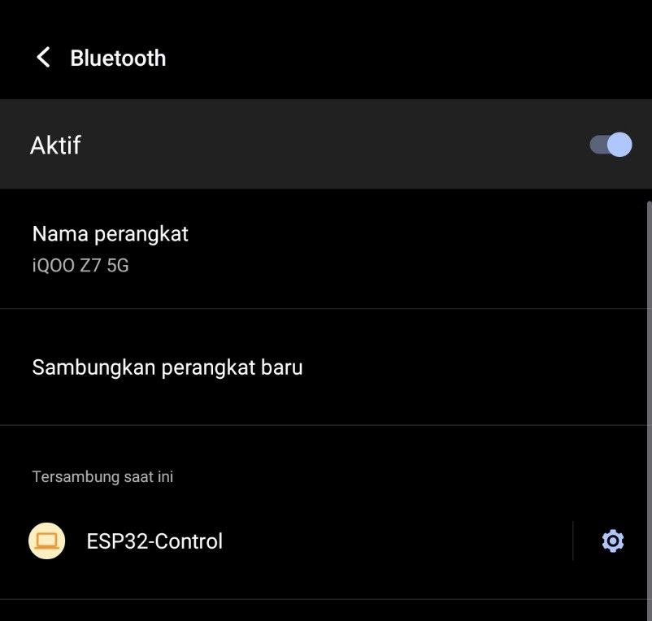

## ESP32 Arduino Communication Via UART + (Bluetooth Connecth to Smarthphone)

**Menghubungkan ESP32 dengan ARduino UNO dengan UART**

**Pengantar UART**
UART atau Universal Asynchronous Receive Transmit adalah salah satu cara termudah untuk mengkomunikasikan dua device seperti menghubungkan arduino dan ESP32. UART mengirimkan data melalui dua kabel di antara arduino dan esp32, satu untuk jalur transmisi dan satunya untuk jalur penerima.



* **Rangkaian ESP32 dan Arduino**



* **Komponen yang dibutuhkan:**
    * LED (1 buah)
    * Arduino UNO(1 buah)
    * ESP32 (1 buah)
    * Breadboard (1 buah)
    * Sensor HC-SR04 (1 buah)
    * Kabel jumper (Secukupnya)
    * Resistor 220 Ohm (1 buah)
    * ESP32 Expansion Board 30 Pin (Opsional)

* **Penjelasan rangkaian Arduino:**
    * GND Arduino dihubungkan ke jalur negatif di breadboard
    * 5V Arduino dihubungkan ke jalur positif di breadboard
    * Salah satu jalur negatif breadboard dihubungkan ke pin GND Sensor Ultrasonik
    * Salah satu jalur positif breadboard dihubungkan ke pin VCC Sensor Ultrasonik
    * pin 6 digital pin dihubungkan ke pin TRIG Sensor Ultrasonik
    * pin 7 digital pin dihubungkan ke pin ECHO Sensor Ultrasonik
    * Kaki LED yang lebih pendek (katoda) dihubungkan ke jalur negatif di breadboard
    * Digital pins 5 pada Arduino dihubungkan ke breadboard seperti pada gambar
    * Kaki LED yang lebih panjang (anoda) dihubungkan ke pin digital yang sudah terhubung pada breadboard melalui resistor
    * Digital pin 2 dihubungkan ke pin D34 ESP32
    * Digital pin 3 dihubungkan ke pin D35 ESP32

* **Penjelasan rangkaian ESP32:**
    * Pin D34 dibungkan ke Digital pin 2 Arduino UNO
    * Pin D35 dibungkan ke Digital pin 3 Arduino UNO

* **Hal - hal yang perlu diperhatikan saat ingin mengubungkan Arduino UNO dengan ESP32 Via UART:**
    * Pin TX RX Arduino UNO tidak bisa digunakan saat program baru akan diupload ke Arduino. Oleh karena itu, Digital pin 2 dan 3 digunakan sebagai gantinya.
    * Baud rate pada ESP32 harus sama dengan Serial Arduino. Misal,Kode Arduino Uno (yang menggunakan SoftwareSerial) harus diinisialisasi dengan Jarak.begin(9600); maka Kode ESP32 (yang menggunakan Serial2) juga harus diinisialisasi dengan Serial2.begin(9600, SERIAL_8N1, RX_pin, TX_pin)
    * Jalur data dari Arduino TX (5V) ke ESP32 RX (3.3V) harus melalui Voltage Level Converter (Level Shifter) atau Voltage Divider (Pembagi Tegangan).
    * Pola Koneks komunikasi UART selalu menggunakan pola silang. TX (Transmit/Kirim) Arduino dihubungkan dengan RX (Receive/Terima) ESP32.RX (Receive/Terima) Arduino. TX (Transmit/Kirim) ESP32

* **Program bagian Arduino**
```cpp
    #include <SoftwareSerial.h>
    // Digunakan untuk mengimport library Software Serial.
    // Diperlukan agar pin digital selain D0/D1 dapat digunakan sebagai pin komunikasi Serial (TX/RX) tambahan.
    SoftwareSerial Jarak(2, 3);
    // Mendeklarasikan objek Software Serial dengan nama Jarak
    // Pin 2 (D2): Ditetapkan sebagai pin RX (Penerima) untuk komunikasi serial.
    // Pin 3 (D3): Ditetapkan sebagai pin TX (Pengirim) untuk komunikasi serial ke ESP32.

    #define TRIG1 6// digunakan untuk memberi nama alias untuk  digital pin 6 di Arduino
    #define ECHO 7 // digunakan untuk memberi nama alias untuk  digital pin 7 di Arduino
    #define LED 5 // // digunakan untuk memberi nama alias untuk digital pin 5 di Arduino
   

    void setup(){
        pinMode(TRIG1, OUTPUT);
        pinMode(ECHO1, INPUT);
        /**
        - pinMode(..., OUTPUT); digunakan untuk memberi tahu Arduino bahwa pin tersebut digunakan 
        untuk keluaran (output), dalam hal ini untuk menyalakan TRIG.
        - pinMode(..., INPUT); digunakan untuk memberi tahu Arduino bahwa pin tersebut digunakan 
        untuk keluaran (intput), dalam hal ini untuk menyalakan ECHO.
        **/
        pinMode(LED, OUTPUT);
        /**
        pinMode(..., OUTPUT); digunakan untuk memberi tahu Arduino bahwa pin tersebut digunakan 
        untuk keluaran (output), dalam hal ini untuk menyalakan LED.
        **/
        
        Serial.begin(9600); // Menginisialisasi komunikasi Serial Hardware (USB/D0/D1) pada baud rate $9600$ (untuk debugging ke PC).
        Jarak.begin(9600); // Mengaktifkan pin Software Serial (D3 TX) untuk komunikasi ke ESP32 pada baud rate $9600$.
    }

    void loop(){
        digitalWrite(TRIG1, HIGH); // Sensor akan mengirim gelombang ultrasonik
        delayMicroseconds(10); // Memberi pulsa HIGH selama 10 mikrodetik ke pin TRIG 
        digitalWrite(TRIG1, LOW); // Sensor berhenti mengirim gelombang ultrasonik
    
        double selang = pulseIn(ECHO1, HIGH); // // mengukur lama waktu (dalam mikrodetik) pin ECHO menerima sinyal HIGH

        double jarak = (selang * 0.0343) / 2.0;
         /**
            - Kecepatan suara di udara ≈ 0,0343 cm/µs
            - selang * 0.0343 → menghitung jarak total tempuh suara (pergi + pulang)
            - Dibagi 2 → mendapatkan jarak sebenarnya ke objek (hanya satu arah)
        **/

        if(jarak < 10) { // Untuk mengecek apakah jarak kurang dari 10 cm
            digitalWrite(LED, HIGH); // Jika iya LED dinyalakan
            delay(500); // delay 500 ms
        }
        

        Serial.print("Jarak: "); Serial.print(jarak); Serial.println("cm");
        // Debugging PC: Menampilkan hasil pengukuran jarak ke Serial Monitor PC melalui koneksi USB.
        
        Jarak.print("Jarak: "); 
        Jarak.print(jarak); 
        Jarak.println("cm");
        // Komunikasi ESP32: Mengirimkan hasil pengukuran jarak ke pin D3 (TX Software Serial) yang terhubung ke ESP32. Penggunaan println() penting untuk mengirim karakter newline.
   
        delay(1000); // delay 1000 ms
    }
```

* **Program bagian ESP32**
```cpp
    #include "BluetoothSerial.h" // Mengimpor library utama untuk mengaktifkan fungsi Bluetooth Serial Port Profile (SPP) pada ESP32.

    #if !defined(CONFIG_BT_ENABLED) || !defined(CONFIG_BLUEDROID_ENABLED)
    #error Bluetooth is not enabled! Please run 'make menuconfig' to enable it.
    #endif
    // Cek kondisi pre-processor untuk memastikan dukungan Bluetooth diaktifkan dalam pengaturan ESP32. Jika tidak, akan muncul error.

    #define RXD2 35 // Pin penerima data dari Arduino (Arduino TX -> ESP32 RXD2)
    #define TXD2 34 // Pin pengirim data ke Arduino (ESP32 TXD2 -> Arduino RX)
    const long BAUD_RATE = 9600; // Harus sama dengan Serial Arduino

    BluetoothSerial SerialBT; 
    // Objek untuk komunikasi Bluetooth ke HP
    String currentStatus = "Memulai..."; 

    void setup() {
    Serial.begin(115200); // Serial Monitor USB (Untuk debugging ESP32)
    Serial.println("ESP32 Bluetooth Bridge Started.");

    Serial2.begin(BAUD_RATE, SERIAL_8N1, RXD2, TXD2); 
    // Serial2 (UART2) diinisiasi untuk komunikasi dengan arduino

    // Inisialisasi Bluetooth Serial ke HP
    SerialBT.begin("ESP32-Jarak"); 
    Serial.println("Bluetooth Device siap terhubung dengan nama: ESP32-Jarak");
    }

    void loop() {
    //Cek Data Masuk dari Arduino (via UART2)
    if (Serial2.available()) { // <-- Menggunakan Hardware Serial 2
        String receivedData = Serial2.readStringUntil('\n');
        receivedData.trim(); // Menghapus spasi

        if (receivedData.length() > 0) {
        // Mengecek apakah panjang data lebih dari 10
        currentStatus = receivedData; 

        // Tampilkan data di Serial Monitor USB ESP32 (debugging)
        Serial.print("Data dari Arduino: ");
        Serial.println(currentStatus);
        
        // Kirim data ke HP via Bluetooth
        SerialBT.println(currentStatus); 
        }
    }
    delay(10); 
}
```

* **Setelah program berjalan dan berhasil terhubung akan muncul "ESP32-Control di Bluetooth HP"**


* **Jika sudah tersambung tampilannya seperti ini:**



* **Link Video Demo** : Belum ada atau bisa kunjungi ini [Komunikasi Serial Arduino Uno R3 Ke ESP32 - Pin RX TX](https://youtu.be/xX-IqN-ZB-o?si=NUvp9IvgZjgtDt1k)
