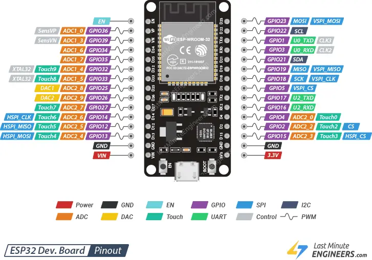

## ESP32 Dasar

---

**Penejelasan PIN ESP32 (30PIN)**
Sumber: [Penjelasan Pin ESP32](https://lastminuteengineers.com/esp32-pinout-reference/)

**1. GPIO PINS**

ESP32 memiliki 25 pin GPIO yang dapat diberi fungsi berbeda dengan memprogram register yang sesuai. Ada beberapa jenis GPIO: digital only, analog, sentuh kapasitif, dll. GPIO analog dan sentuh kapasitif dapat dikonfigurasi sebagai GPIO digital. Sebagian besar GPIO digital ini dapat dikonfigurasi dengan pull-up atau pull-down internal, atau diatur ke impedansi tinggi.

Meskipun ESP32 punya banyak pin dengan bermcam macam fungsi, beberapa diantaranya mungkin tidak bisa digunakan untuk projek. Tabel dibawah ini menunjukkan mana pin GPIO yang aman digunakan dan mana pin yang sebaiknya digunakan dengan hati- hati.

:white_check_mark: : Aman digunakan
:warning: : GUnakan saat perlu, tapi hati-hati saat booting
:x: : Direkomendasikan untuk tidak digunakan

| Label | GPIO | Aman digunakan? | Alasan |
| :--- | :--- | :--- | :--- |
| D0 | 0 | :warning: | harus bernilai HIGH saat boot dan LOW saat programming|
| TX0 | 1 | :x: | pin TX digunakan untuk flashing dan debugging |
| D2 | 2 | :warning: | harus bernilai LOW saat boot dan juga terhubing dengan LED pada board ESP |
| RX0 | 3 | :x: | pin RX digunkan untuk flashing dan debugging |
| D4 | 4 | :white_check_mark:| |
| D5 | 5 | :warning: | harus bernilai HIGH saat boot |
| D6 | 6 | :x: | terhubung dengan flash memory |
| D7 | 7 | :x: | terhubung dengan flash memory |
| D8 | 8 | :x: | terhubung dengan flash memory |
| D9 | 9 | :x: | terhubung dengan flash memory |
| D10 | 10 | :x: | terhubung dengan flash memory |
| D11 | 11 | :x: | terhubung dengan flash memory |
| D12 | 12 | :warning: | harus bernilai LOW saat boot |
| D13 | 13 | :white_check_mark:| |
| D14 | 14 | :white_check_mark:| |
| D15 | 15 | :warning: | harus bernilai HIGH saat boot, untuk mencegah , untuk mencegah terblokirnya proses startup |
| RX2 | 16 | :white_check_mark:| |
| TX2 | 17 | :white_check_mark:| |
| D18 | 18 | :white_check_mark:| |
| D19 | 19 | :white_check_mark:| |
| D21 | 21 | :white_check_mark:| |
| D22 | 22 | :white_check_mark:| |
| D23 | 23 | :white_check_mark:| |
| D25 | 25 | :white_check_mark:| |
| D26 | 26 | :white_check_mark:| |
| D27 | 27 | :white_check_mark:| |
| D32 | 32 | :white_check_mark:| |
| D33 | 33 | :white_check_mark:| |
| D34 | 34 | :warning:| Hanya bisa input, tidak bisa diubah menjadi ouput |
| D35 | 35 | :warning:| Hanya bisa input, tidak bisa diubah menjadi ouput |
| VP | 36 | :warning:| Hanya bisa input, tidak bisa diubah menjadi ouput |
| VN | 39 | :warning:| Hanya bisa input, tidak bisa diubah menjadi ouput |

    
