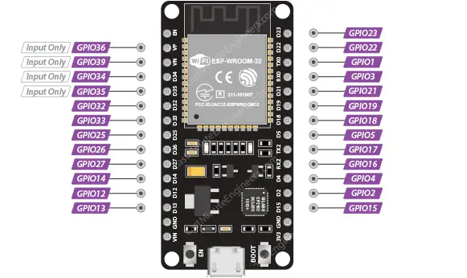

## ESP32 Dasar

**Penejelasan PIN ESP32 (30PIN)**
**1. GPIO PINS**

ESP32 memiliki 25 pin GPIO yang dapat diberi fungsi berbeda dengan memprogram register yang sesuai. Ada beberapa jenis GPIO: digital only, analog, sentuh kapasitif, dll. GPIO analog dan sentuh kapasitif dapat dikonfigurasi sebagai GPIO digital. Sebagian besar GPIO digital ini dapat dikonfigurasi dengan pull-up atau pull-down internal, atau diatur ke impedansi tinggi.

Meskipun ESP32 punya banyak pin dengan bermcam macam fungsi, beberapa diantaranya mungkin tidak bia digunakan untuk projek. Tabel dibawah ini menunjukkan mana pin GPIO yang aman digunakan dan mana pin yang sebaiknya digunakan dengan hati- hati

    
