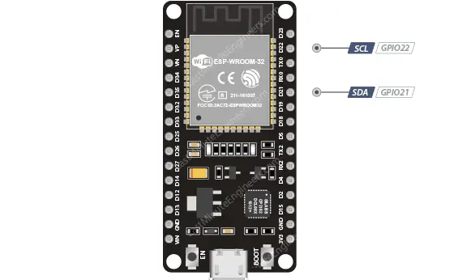

## ESP32 Dasar

---

## Penejelasan PIN ESP32 (30PIN)

Sumber: [Penjelasan Pin ESP32](https://lastminuteengineers.com/esp32-pinout-reference/)

**1. PIN GPIO**

ESP32 memiliki 25 pin GPIO yang dapat diberi fungsi berbeda dengan memprogram register yang sesuai. Ada beberapa jenis GPIO, yaitu digital only, analog, sentuh kapasitif, dll. GPIO analog dan sentuh kapasitif dapat dikonfigurasi sebagai GPIO digital. Sebagian besar GPIO digital ini dapat dikonfigurasi dengan pull-up atau pull-down internal, atau diatur ke impedansi tinggi.

Meskipun ESP32 punya banyak pin dengan bermcam macam fungsi, beberapa diantaranya mungkin tidak bisa digunakan untuk projek. Tabel dibawah ini menunjukkan mana pin GPIO yang aman digunakan dan mana pin yang sebaiknya digunakan dengan hati- hati.

:white_check_mark: : Aman digunakan
:warning: : Gunakan saat perlu, tapi hati-hati saat booting
:x: : Direkomendasikan untuk tidak digunakan

| Label | GPIO | Aman digunakan? | Alasan |
| :--- | :--- | :--- | :--- |
| D0 | 0 | :warning: | harus bernilai HIGH saat boot dan LOW saat programming|
| TX0 | 1 | :x: | pin TX digunakan untuk flashing dan debugging |
| D2 | 2 | :warning: | harus bernilai LOW saat boot dan juga terhubing dengan LED pada board ESP |
| RX0 | 3 | :x: | pin RX digunkan untuk flashing dan debugging |
| D4 | 4 | :white_check_mark:| |
| D5 | 5 | :warning: | harus bernilai HIGH saat boot |
| D6 | 6 | :x: | terhubung dengan flash memory |
| D7 | 7 | :x: | terhubung dengan flash memory |
| D8 | 8 | :x: | terhubung dengan flash memory |
| D9 | 9 | :x: | terhubung dengan flash memory |
| D10 | 10 | :x: | terhubung dengan flash memory |
| D11 | 11 | :x: | terhubung dengan flash memory |
| D12 | 12 | :warning: | harus bernilai LOW saat boot |
| D13 | 13 | :white_check_mark:| |
| D14 | 14 | :white_check_mark:| |
| D15 | 15 | :warning: | harus bernilai HIGH saat boot, untuk mencegah , untuk mencegah terblokirnya proses startup |
| RX2 | 16 | :white_check_mark:| |
| TX2 | 17 | :white_check_mark:| |
| D18 | 18 | :white_check_mark:| |
| D19 | 19 | :white_check_mark:| |
| D21 | 21 | :white_check_mark:| |
| D22 | 22 | :white_check_mark:| |
| D23 | 23 | :white_check_mark:| |
| D25 | 25 | :white_check_mark:| |
| D26 | 26 | :white_check_mark:| |
| D27 | 27 | :white_check_mark:| |
| D32 | 32 | :white_check_mark:| |
| D33 | 33 | :white_check_mark:| |
| D34 | 34 | :warning:| Hanya bisa input, tidak bisa diubah menjadi ouput |
| D35 | 35 | :warning:| Hanya bisa input, tidak bisa diubah menjadi ouput |
| VP | 36 | :warning:| Hanya bisa input, tidak bisa diubah menjadi ouput |
| VN | 39 | :warning:| Hanya bisa input, tidak bisa diubah menjadi ouput |

**Pin GPIO Input Only**

Pin GPIO34, GPIO35, VP, VN Tidak dapat dikonfigurasi sebagai keluaran. Pin-pin ini dapat digunakan sebagai masukan digital atau analog, atau untuk tujuan lain. Pin-pin ini juga tidak memiliki resistor pull-up dan pull-down internal, tidak seperti pin GPIO lainnya.

**ESP32 Interrupt Pins**

Semua GPIO pin bisa dikonfigurasi sebagai interrupt. Interrupt adalah mekanisme di mana ESP32 langsung berhenti dari tugas yang sedang dikerjakan untuk merespon suatu kejadian penting pada pin tertentu. Setelah selesai, ESP32 akan kembali melanjutkan program utama.

---

**2. PIN ADC**

Analog to Digital Converter (ADC) adalah fitur pada ESP32 yang bisa membaca sinyal analog (tegangan variabel) lalu mengubahnya menjadi data digital (angka). ADC ESP32 adalah ADC 12-bit, yang berarti dapat mendeteksi 4096 (2^12) level analog diskrit. Dengan kata lain, ADC ini akan mengonversi tegangan input mulai dari 0 hingga 3,3V (tegangan operasi) menjadi nilai integer mulai dari 0 hingga 4095. Hal ini menghasilkan resolusi 3,3 volt / 4096 unit, atau 0,0008 volt (0,8 mV) per unit.

---

**3. PIN DAC**

Digital to Analog Converter (DAC) adalah fitur yang bisa membaca angka digital lalau mengubahnya menjadi teganagan analog. DAC ini memiliki resolusi 8-bit, yang berarti bahwa nilai dalam rentang 0 hingga 256 akan diubah ke tegangan analog dalam rentang 0 hingga 3,3V.

---

**4. PIN Touch**

Pin Touch adalah fitur di ESP32 yang memungkinkan ESP32 mendeteksi sentuhan jari atau perubahan kapasitas pada permukaan konduktif yang terhubung ke pin tersebut. Fitur ini tidak memerlukan komponen tambahan (seperti IC touch sensor eksternal) karena sudah bawaan chip.

Pin touch ESP32 bekerja dengan prinsip kapasitansi. Saat jari (atau benda konduktif) menyentuh pad, kapasitansi berubah, dan ESP32 bisa membaca perubahan itu sebagai nilai angka.
Semakin kuat sentuhan maka semakin besar perubahan kapasitansinya.

---

**5. PIN I2C**

ESP32 memiliki 2 bus interface I2C, tetapi tidak memiliki pin I2C khusus. Sebagai gantinya, pin GPIO bisa dikonfigurasi sebagai I2C SDA (jalur data) dan SCL (jalur clock). Namun, GPIO21 (SDA) dan GPIO22 (SCL) umunya digunakan sebagai pin I2C default pengguna yang menggunakan kode, library, dan sketch Arduino yang sudah ada.

---

**6. PIN SPI**

SPI (Serial Peripheral Interface) adalah salah satu protokol komunikasi cepat yang dipakai ESP32 untuk bertukar data dengan perangkat eksternal. Komunikasi pin SPI melibatkan 4 pin utama:
* 1. MISO (Master In Slave Out) → Jalur data dari Slave ke Master
* 2. MOSI (Master Out Slave In) → Jalur data dari Master ke Slave
* 3. SCLK (Serial Clock) → Sinyal clock yang dihasilkan Master untuk sinkronisasi transfer data
* 4. CS/SS (Chip Select / Slave Select) → Digunakan Master untuk memilih perangkat Slave yang ingin diajak berkomunikasi

ESP32 memiliki lebih dari satu bus SPI, yaitu VSPI (SPI default) dan HSPI (SPI tambahan, bisa digunakan paralel). Selain itu, Pin SPI bisa di-remap (dipindah ke GPIO lain) menggunakan fungsi GPIO Matrix. Jadi tidak terbatas hanya di pin bawaan, lebih fleksibel dibanding Arduino UNO.

---

**7. PIN UART**

ESP32 memiliki tiga interface UART, UART0, UART1, dan UART2, yang mendukung komunikasi asinkron (RS232 dan RS485) dan IrDA hingga 5 Mbps.

* Pin UART0 terhubung ke konverter USB-ke-Serial dan digunakan untuk flashing dan debugging. Oleh karena itu, pin UART0 tidak disarankan untuk digunakan.
* Pin UART1 disediakan untuk chip memori flash terintegrasi.
* Di sisi lain, UART2 merupakan opsi yang aman untuk terhubung ke perangkat UART seperti GPS, sensor sidik jari, sensor jarak, dan sebagainya.

Selain itu, UART menyediakan manajemen perangkat keras sinyal CTS dan RTS serta kontrol aliran perangkat lunak (XON dan XOFF).

---

**8. PIN PWM**

ESP32 memiliki 21 pin PWM yang dikontrol oleh pengontrol PWM. Output PWM dapat digunakan untuk menggerakan motor dan mangatur kecerahan LED. 

---

**9. PIN RTC GPIO**

Beberapa GPIO sirutekan ke subsistem RTC (Real-Time CLock) dan pin ini disebut RTC GPIO. Fungsi utama RTC GPIO:
* Tetap aktif meskipun ESP32 masuk mode **deep sleep**
* Bisa dipakai sebagai **sumber sinyal untuk membangunkan ESP32** dari mode deep sleep
* Mendukung kerja **ULP coprocessor (Ultra Low Power)**, yaitu prosesor kecil di ESP32 yang tetap bisa berjalan saat CPU utama tidur

Dengan kata lain, RTC GPIO memungkinkan ESP32 tetap bisa berinteraksi dengan dunia luar saat dalam mode hemat daya, misalnya bangun ketika tombol ditekan, sensor memberi sinyal, atau timer RTC berbunyi.

---

**10. PIN STRAPPING**

Terdapat 5 pin strapping, yaitu GPIO0, GPIO2, GPIO5, GPIO12, dan GPIO15. Pin-pin ini digunakan untuk menempatkan ESP32 ke mode BOOT (untuk menjalankan program yang tersimpan di memori flash) atau mode FLASH (untuk mengunggah program ke memori flash). Tergantung pada status pin-pin ini, ESP32 akan memasuki mode BOOT atau mode FLASH saat dinyalakan.

---

**11. PIN POWER**

Pada ESP32, terdapat 2 pin power, yaitu Vin pin dan 3V3 pin. Pin Vin bisa digunakan untuk menghubngkan ESP32 dengan daya/baterai eksternal (maksimal 12V). Pin 3V3 memberikan ouput tegangan sebesar 3.3 volt yang bisa digunakan untuk memberi daya ke sensor/modul kecil. GND adalah pin ground yang berfungsi sebagai pin refernsi dengan level 0 volt (0V).

---

**12 PIN EN/RST**

Pin EN/RST adalah pin pengaktif untuk ESP32 yang secara default daiatur ke HIGH. Ketika diatur ke nilai HIGH, chip diaktifkan. Sedangkan, ketika diatur ke nilai LOW, chip dinonaktifkan. Pin EN juga dihubungkan ke tombol EN/RST. Jika tombol tersebut ditekan pin EN akan terhubung ke GND dan akan bernilai LOW. Hal tersebut membuat ESP32 melakukan reset (restart) dan menjalankan program dari awal

---