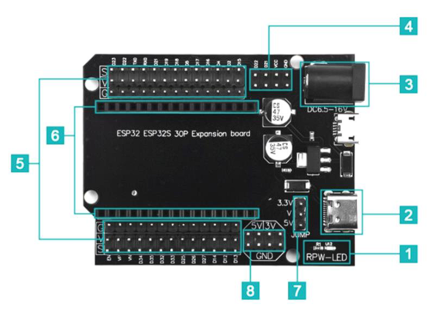

## ESP32 Expansion Board

## Penejelasan PIN ESP32 Expansion Board (30PIN)

**Sumber: **
* [ESP32 Expansion Board Explained](https://handsontec.com/index.php/product/esp32-expansion-board/#:~:text=Description,with%2030%20Pins%20development%20module.)
* 

**1. RPW-LED**
Merupakan indikator power (power LED) yang menunjukkan board sudah mendapat suplai daya (dari USB atau adaptor DC).

---

**2. USB type C**
Berfungsi untuk menghubungkan ESP32 dengan suplai daya eksternal

---

**3. 6v DC - 15 DC Power Input Socket**
Berfungsi untuk menghubungkan ESP32 dengan suplai daya eksternal. Socket ini bisa menggunakan adaptor 6-15v. Nantinya, tegangan masuk akan diregulasi oleh voltage regulator di expansion board menjadi 5v atau 3.3v yang dibutuhkan ESP32.

---

**4. I2C Bus Header Pin**
Pada bagian ini terdapat beberapa pin yang berbeda, yaitu
* VCC : berfungsi untuk memberi Output tegangan sebesar 3.3v/5v tergantung posisi jumper 
* GND : berfungsi sebagai pin referensi dengan level 0 volt (0V)
* D22/GPIO22 : SCL (jalur clock)
* D21/GPIO21 : SDA (jalur data)

---

**5. Power Supply Rail dan I/O Pin Header**
Pada bagian ini terdapat 3 baris yang masing-masing disimbolkan dengan G, V, dan S. Penjelasannya sebgai berikut:
* Baris dengan simbol G (Ground) : merupakan baris dengan pin ground  yang berfungsi sebagai pin referensi dengan level 0 volt (0V)
* Baris dengan simbol V (VCC) : merupakan baris dengan pin VCC yang berfungsi untuk memberi Output tegangan sebesar 3.3v/5v tergantung posisi jumper 
* Baris dengan simbol S (Signal) : Merupakan baris pin sinyal yang langsung terhubung ke GPIO ESP32. Bagian ini sama persis dengan pin-pin ESP32 30 pin yang biasa.

---

**6. Header Connector untuk ESP32 30 Pin**
Bagian ini adalah female header socket tempat memasang ESP32 DevKit V1 (versi 30 pin). Disini seluruh pin ESP32 dihubungkan dengan expanansion board.

---

**7. Voltage Selection Jumper untukPower Rail Supply**
Bagian ini digunakan untuk mengatur tegangan yang keluar dari pin VCC. Bisa atur ke 3.3v atau 5v.

---

**8. 5v/3.3v Ouput Supply Header**
Bagian ini berupa header tambahan yang khusus dipakai untuk mengambil tegangan supply dari expansion board, biasanya untuk memberi daya ke sensor, modul, atau rangkaian eksternal lain. Berikut penjelasannya: 
* Baris atas, dua pin kanan (3v) : merupakan pin output 3.3v dari regulator board
* Baris atas, dua pin kiri (5v) :
Merupakan pin output 5V yang berasal dari USB/DC input (melewati regulator).
* Baris bawah (GND) : merupakan pin yang berfungsi sebagai pin referensi dengan level 0 volt (0V)