### Roboflow

## Link Penting 🔗

* **Webiste Roboflow:**
    * [Roboflow](https://roboflow.com/)

* **Tutorial Video Roboflow**
    * [Roboflow 6 Minute Intro | Build a Coin Counter with Computer Vision](https://youtu.be/a3SBRtILjPI?si=7xPAwz6axoj7Bg5j)
    * [Cara Membuat Dataset yolo v8 di Roboflow ( labelling dan augmentasi )](https://youtu.be/qBTDnczga18?si=sr028SW4vYZ39k_y)
    * [Roboflow Rapid: Deploy Object Detection Model under 5 mins!](https://youtu.be/7jZZ_MRjf4o?si=euR4Hzn4yZIHKvze)

* **Roboflow Random Playlist: (Belum tak tonton :v)**
    * [Weekly Roboflow Product Session](https://youtube.com/playlist?list=PLZCA39VpuaZZpdXJ_WdLCPwe63W1modTC&si=-txm0bNoN0x7UYFB)
    * [Computer Vision with Roboflow](https://youtube.com/playlist?list=PLkz_y24mlSJZpIGbH3ENoeh_amJpJ2BME&si=Q4lLbqLgE4Y20CKY)

-----

## Apa itu Roboflow?
Roboflow adalah platform end-to-end untuk computer vision yang memudahkan developer dan perusahaan dalam membangun, melatih, serta mendeploy model machine learning berbasis penglihatan komputer, mulai dari anotasi data citra (gambar dan video) dengan bantuan AI, pengelolaan dataset, preprocessing, augmentation, training model state-of-the-art, hingga deployment ke cloud atau edge devices.

## Tahapan Pembuatan Model di Roboflow
### 1. Menyiapkan Dataset
Dataset untuk pengembangan model dapat diperoleh melalui tiga metode utama, yaitu
* Pencarian Manual: Mengumpulkan gambar secara spesifik melalui mesin pencari (seperti Google Images) sesuai dengan objek yang ingin diteliti.
* Public Repository: Memanfaatkan platform penyedia dataset terbuka seperti Kaggle, Roboflow Universe, atau Google Dataset Search yang menyediakan ribuan data siap pakai.
* Pengambilan Data Langsung (Primary Data): Melakukan pemotretan atau perekaman video mandiri di lapangan untuk mendapatkan data yang lebih relevan dengan kondisi asli (real-world environment).

Webiste Kaggle: [Level up with the largest AI & ML community](https://www.kaggle.com/)
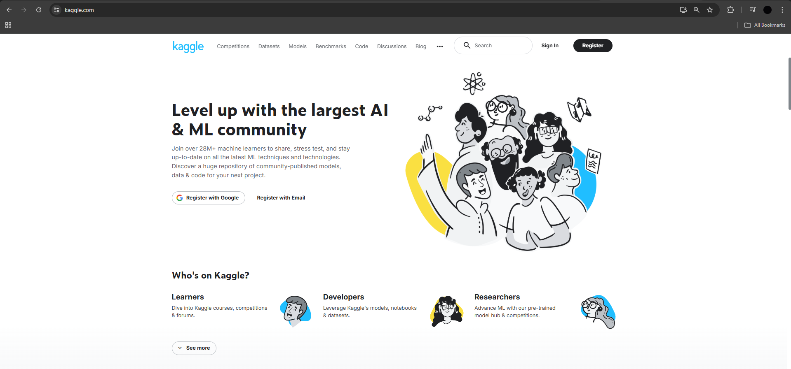

Website Roboflow Universe: [Explore the Roboflow Universe](https://universe.roboflow.com/)
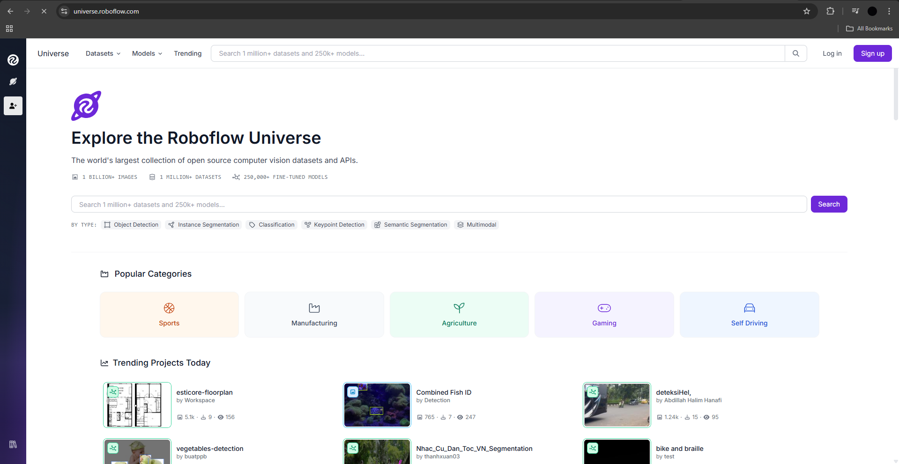

Website Google Dataset: [Dataset Search](https://datasetsearch.research.google.com/)
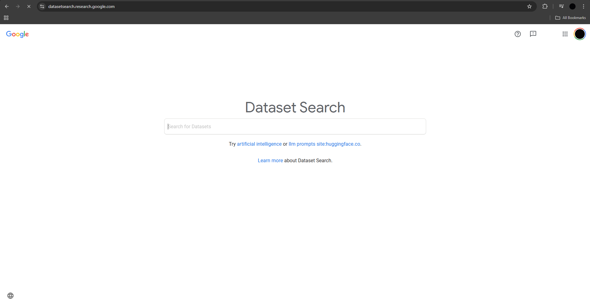

#### 2. Membuat Projek dan Upload Data
Setelah membuat proyek dengan memilih salah satu tipe, misal Object detection. Hal yang perlu dilakukan selanjutnya adalah mengunggah dataset.

1. Membuat Projek dengan tipe Object Detection
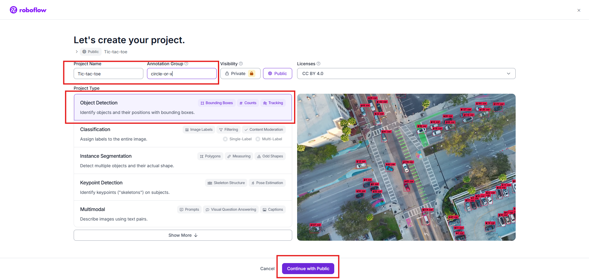

2. Pilih pembuatan model dengan cara Tradisional (bukan rapid)
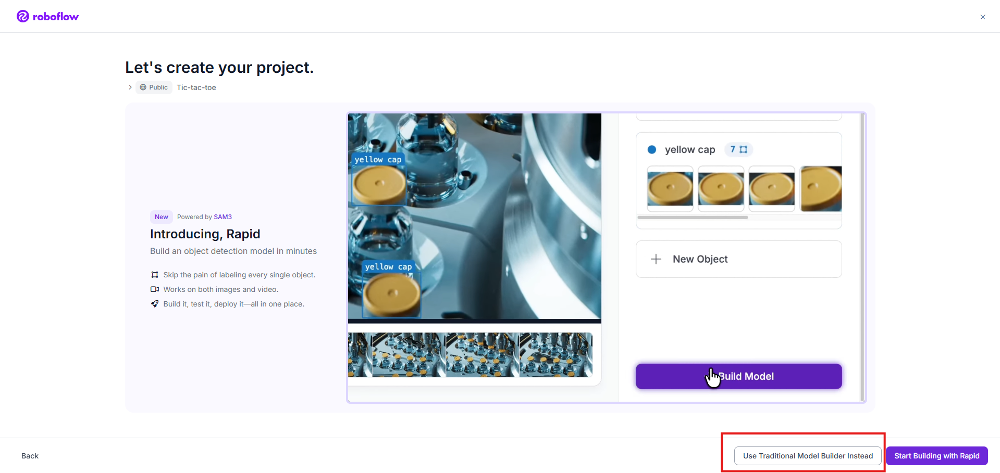

3. Dataset yang sudah dikumpulkan
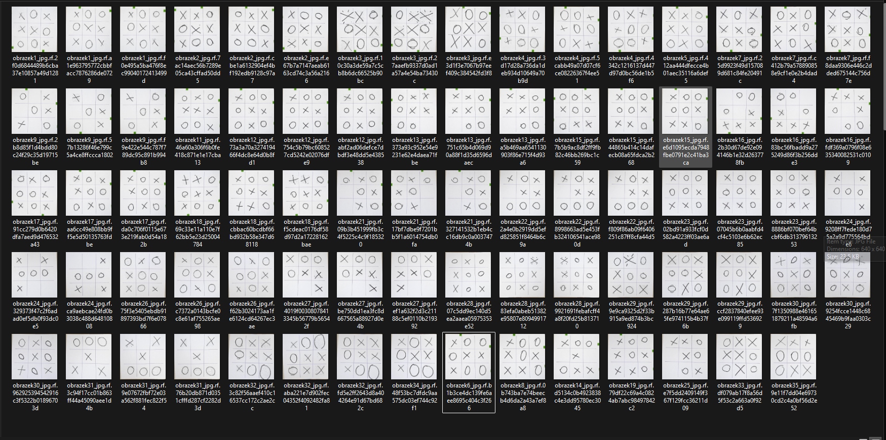

4. Upload Dataset yang sudah dikumpulkan, lalu klik `save and continue`
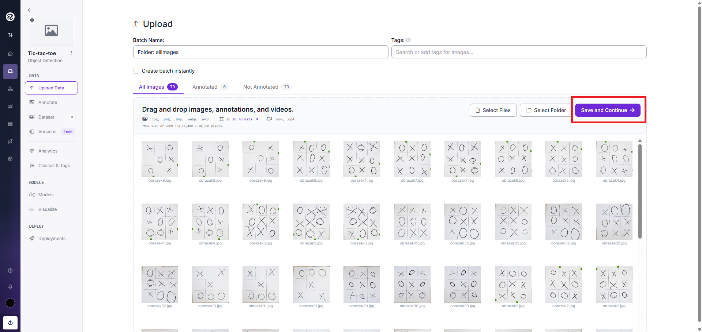

#### 3. Annotate (Pelabelan)
Jika gambar yang dijadikan datset belum memiliki label, setiap gambar harus diberi label sesuai kategorinya masing-masing. Untuk melakukannya, gunakan fitur Roboflow Annotate.

1. Setelah semua dataset terupload, pilih menu `Label Myself`
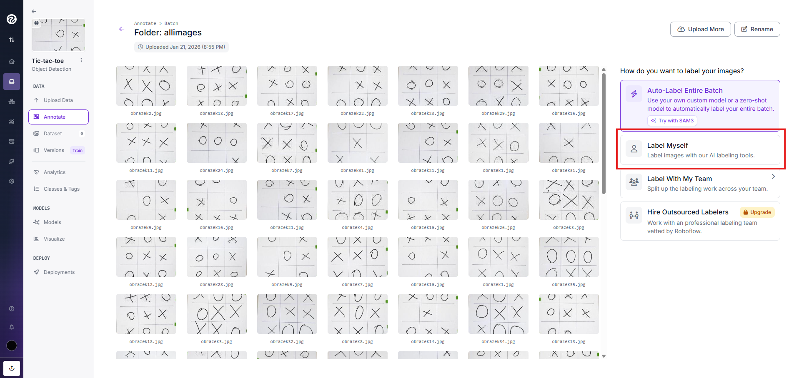

2. Lalu tekan tombol `Start Annotating`
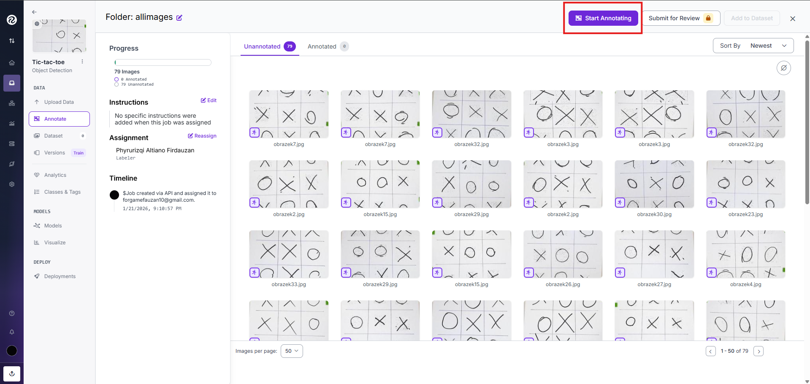

3. Drag tool
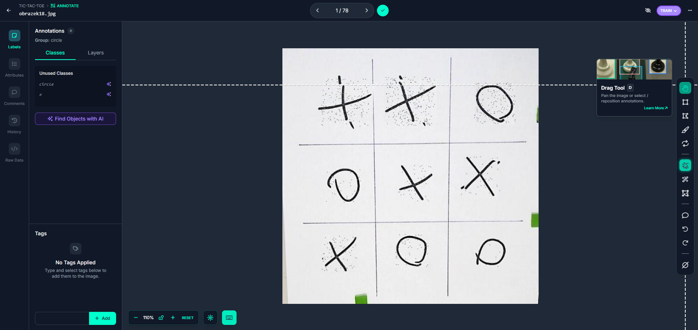

Drag Tool adalah alat seleksi/kursor yang digunakan untuk memanipulasi Bounding Box yang sudah dibuat. Fungsi yang paling sering digunakan adalah untuk mengatur Posisi (Repositioning). Jika kotak yang dibuat sedikit miring atau kurang pas, Anda bisa mengklik bagian tengah kotak dan menggesernya (drag) ke posisi yang benar. User juga bisa menarik titik-titik di sudut kotak untuk memperbesar atau memperkecil ukurannya.

4. Bounding Box
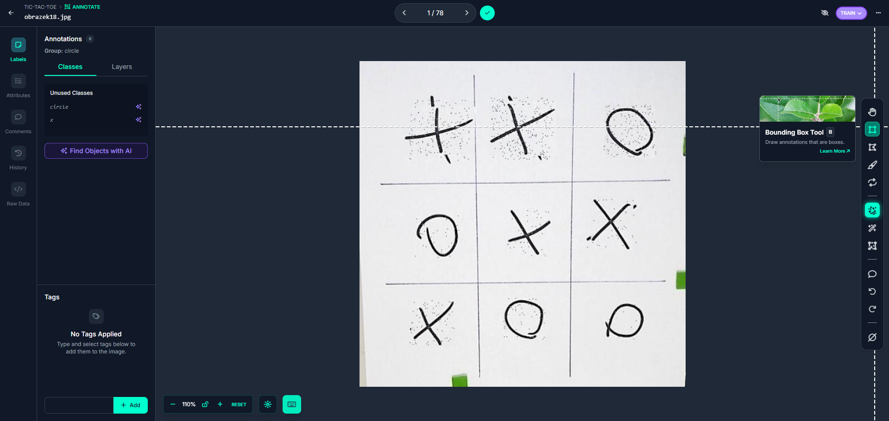

Bounding Box adalah kotak persegi panjang yang digambar mengelilingi objek target (dalam kasus Anda, simbol X atau O). Kotak ini berfungsi sebagai koordinat yang menentukan posisi objek di dalam sebuah gambar. Tool ini berfungsi untuk **memberikan label pada area spesifik agar model memahami bentuk dan lokasi objek**.

5. Hasil Annotating
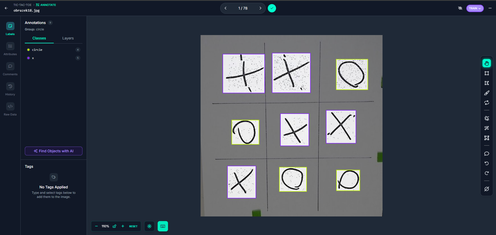

6. Mengganti Label Annotate
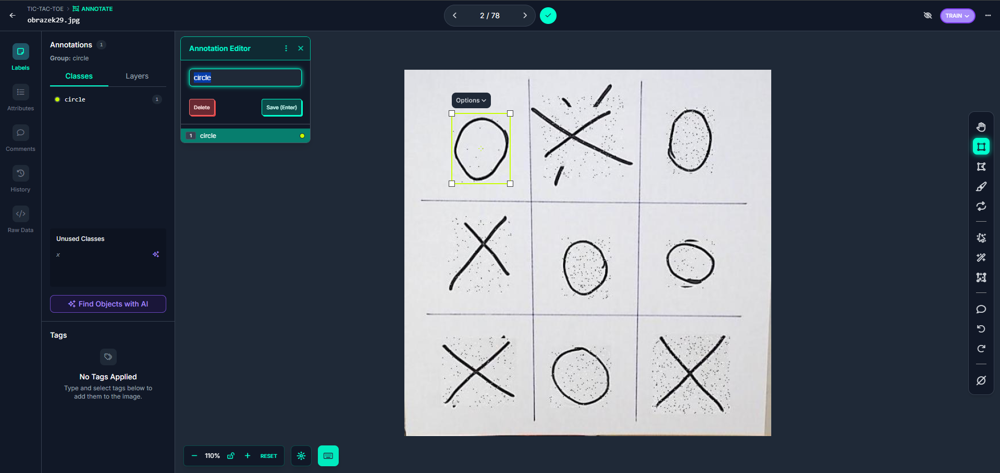

Untuk mengganti label misal dari `circle` ke `x`, cukup ketikan nama label di menu Annotation Editor. Jika label yang diinginkan belum ada, maka akan otomatis ditambahkan menjadi kelas label baru.

7. Menambahkan Images ke Dataset
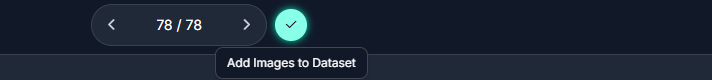

Setelah semua images sudah di anotasi, klik tombol sentang seperti pada gambar diatas.

8. Dataset Menagement
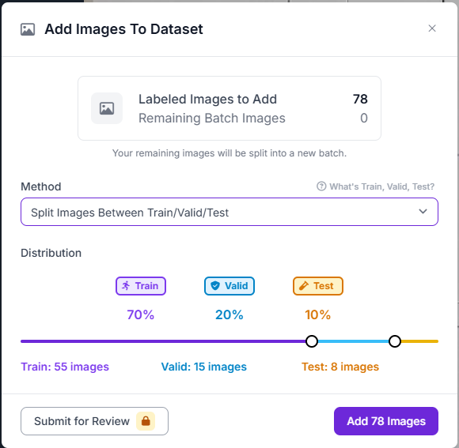

Setelah semua gambar diberi label, data perlu dibagi menjadi 3 kategori, yaitu
* Train: Data untuk dipelajari model.
* Valid: Data untuk mengevaluasi model saat pelatihan.
* Test: Data untuk mengevaluasi model saat pelatihan.
Pembagian bisa dilakukan sama seperti gambar diatas.

#### 4. Preprocessing
Langkah ini diterapkan pada seluruh gambar untuk memastikan konsistensi. Beberapa yang bisa dilakukan seperti
* Auto-Orient: Menghapus metadata orientasi EXIF.
* Resize: Menyesuaikan ukuran gambar (misalnya 640x640) agar sesuai dengan input model YOLO Ultralytics.
* Grayscale: Mengubah warna menjadi hitam putih jika warna tidak relevan.

1. Menu Preprocessing
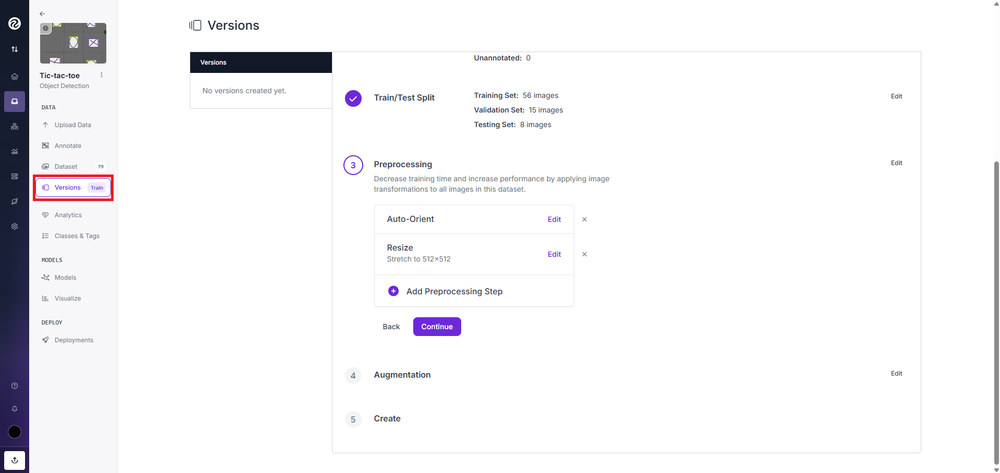

Untuk melakukan preprocessing, pilih menu version dan scroll ke bawah sampai menemukan menu preprocessing.

2. Pengaturan Preprocessing
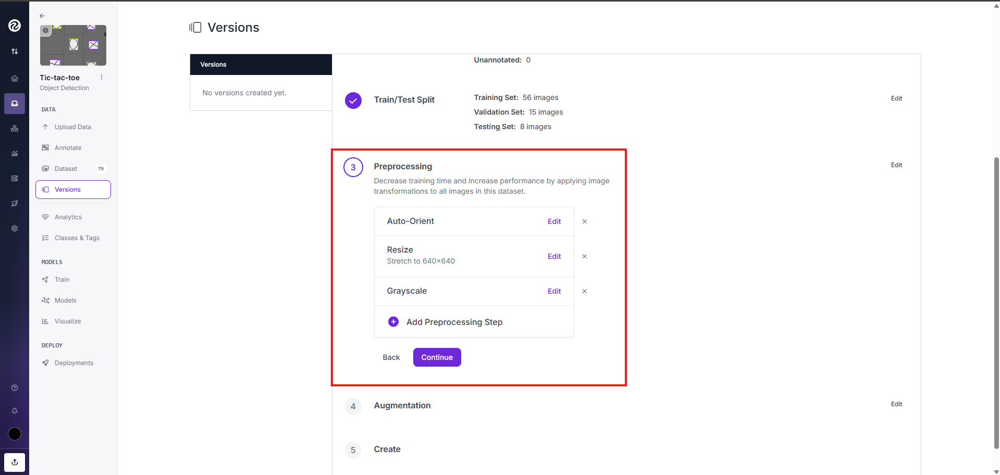

Pengaturan preprocessing bisa dilakukan sama seperti pada gambar diatas atau menggunakan pengaturan yang lain. 

#### 5. Augmentasi
Berbeda dengan preprocessing, augmentasi hanya diterapkan pada Train Set untuk membuat variasi data baru agar model lebih kuat (robust). Beberapa yang bisa dilakukan seperti
* Flip & Rotation: Memutar gambar.
* Blur & Noise: Menambah gangguan visual.
* Brightness/Exposure: Simulasi kondisi cahaya yang berbeda.

1. Menu Augmentasi
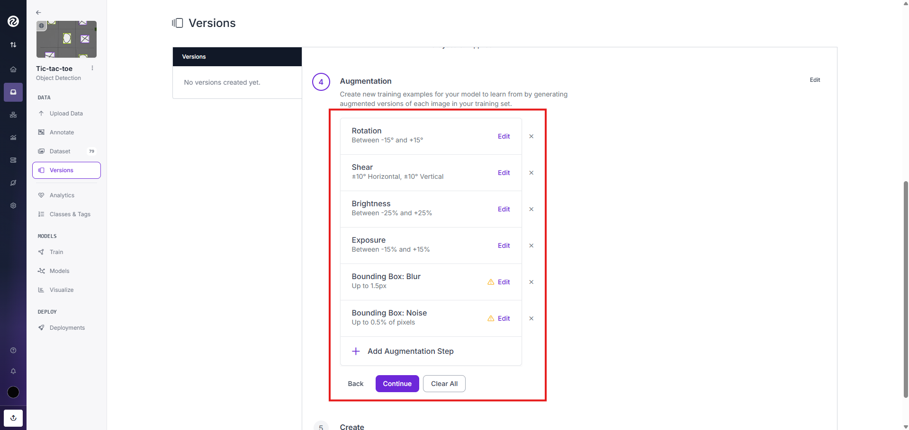

Untuk melakukan augmentasi, scroll ke bawah dari menu preprocessing sampai menemukan menu augmentasi. Pengaturan augmentasi bisa dilakukan sama seperti pada gambar diatas atau menggunakan pengaturan yang lain.

2. Create Dataset
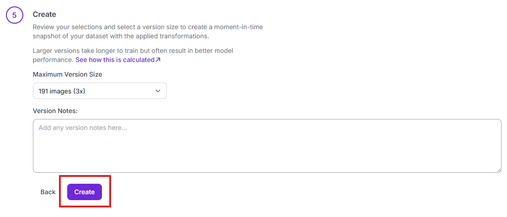

Jika semua tahapan sebelumnya sudah selesai, scroll ke bawah menuju menu create. Di sini user bisa memilih "Maximum Version Size" dan memberi "Notes" mengenai dataset yang baru dibuat. Jika sudah selesai, user bisa menekan tombol create.

#### 6. Generate & Export
Ini adalah langkah terakhir sebelum melatih model dengan Ultralytics dan Google Colab. 
1. Klik tombol "Generate" untuk membuat versi dataset (Snapshot).
2. Setelah selesai, klik "Export Dataset".
3. Pilih format "YOLOv8" (atau versi YOLO yang Anda gunakan dari Ultralytics).
4. Pilih opsi "dowload zip to computer"
5. Upload dataset ke [Ultralytics HUB](https://hub.ultralytics.com/)