### Ultralytics

## Link Penting 🔗

* **Webiste Ultralytics:**
    * [Ultralytics](https://www.ultralytics.com/)
    * [Ultralytics HUB](https://hub.ultralytics.com/)

* **Tutorial Video Ultralytics**
    * [Komplit Tutorial YOLOv8 Untuk Pemula](https://youtu.be/1hGVVac-GL8?si=FZmzfTaV7GcBgLKb)
    

* **Ultralytics Random Playlist: (Belum tak tonton :v)**
    * [Ultralytics YOLO11](https://youtube.com/playlist?list=PL1FZnkj4ad1P9gulU2Ud6y-1m1fKXTPGW&si=Bpu9pipkJ5Zj701D)

-----

## Apa itu Ultralytics?
platform vision AI terkemuka yang mengembangkan model YOLO (You Only Look Once) series—seperti YOLO11 sebagai versi terbaru—yang menjadi standar dunia untuk object detection real-time, instance segmentation, pose estimation, classification, serta object tracking. Ultralytics menyediakan library open-source Python yang mudah digunakan untuk melatih, memvalidasi, dan mendeploy model computer vision secara cepat dan akurat pada berbagai perangkat (edge hingga cloud), serta platform no-code Ultralytics HUB untuk membangun model tanpa pemrograman.

## Apa itu YOLO?
YOLO atau You Only Look Once adalah seri model object detection real-time  yang memproses gambar hanya dalam satu pass melalui neural network untuk secara simultan memprediksi bounding box dan kelas objek, sehingga jauh lebih cepat daripada detector dua tahap seperti Faster R-CNN. Dikembangkan pertama kali oleh Joseph Redmon pada 2015, YOLO kini dikelola utama oleh Ultralytics dengan versi terbaru YOLO11 (dirilis 2024) yang mendukung multi-task seperti detection, instance segmentation, pose estimation, classification, dan object tracking dengan performa state-of-the-art, akurasi tinggi, serta efisiensi lebih baik (parameter lebih sedikit tapi mAP lebih tinggi).

## Apa itu Google Colab?
Google Colaboratory, atau sering disebut Google Colab, adalah layanan berbasis cloud (komputasi awan) yang disediakan oleh Google secara gratis. Dalam proses pembuatan model Object Detection, Google Colab memegang bebrapa peran penting, yaitu sebagai **Penyediaan GPU Gratis**
dan **Lingkungan yang Siap Pakai**. Google Collab memberikan akses gratis ke GPU (Graphics Processing Unit) seperti NVIDIA T4. GPU dapat mempercepat proses training hingga 10-20 kali lebih cepat dibandingkan laptop standar. Selain itu, Colab sudah menyediakan library populer seperti OpenCV, TensorFlow, dan PyTorch. Untuk menggunakan Ultralytics, Anda cukup menjalankan satu baris kode instalasi saja (!pip install ultralytics), dan lingkungan kerja langsung siap digunakan.

## Tahapan Melatih Model di Ultralytics HUB dan Google Collab
### 1. Upload Dataset
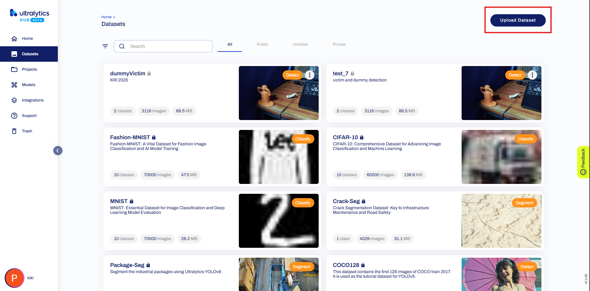

Untuk mengupload dataset ke Ultralytics HUB, tekan tombol "Upload".

### 2. Pengaturan Dataset
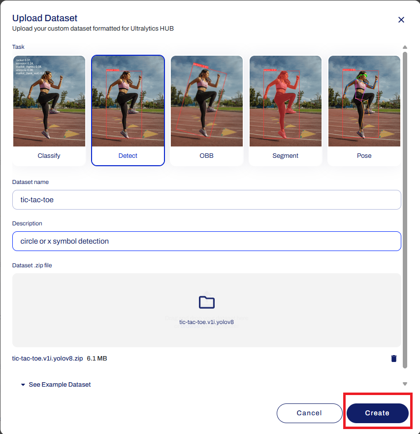

Sebelum dataset diupload, perlu diatur dulu datasetnya. Seperti task, nama dataset, dan deskripsi dataset. Dataset yang diupload harus berformat `.zip`. Jika sudah melakukan pengaturan dataset, klik tombol "Create".

### 3. Pilih Dataset yang baru dibuat
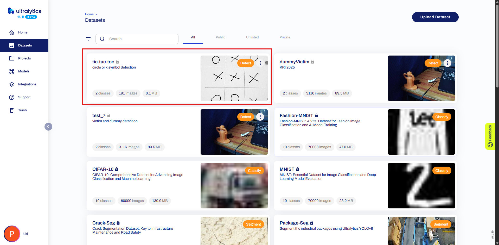

Setelah menekan tombol "Create", akan muncul dataset baru. Tekan dataset tersebut untuk memulai proses training.


### 4. Latih Model
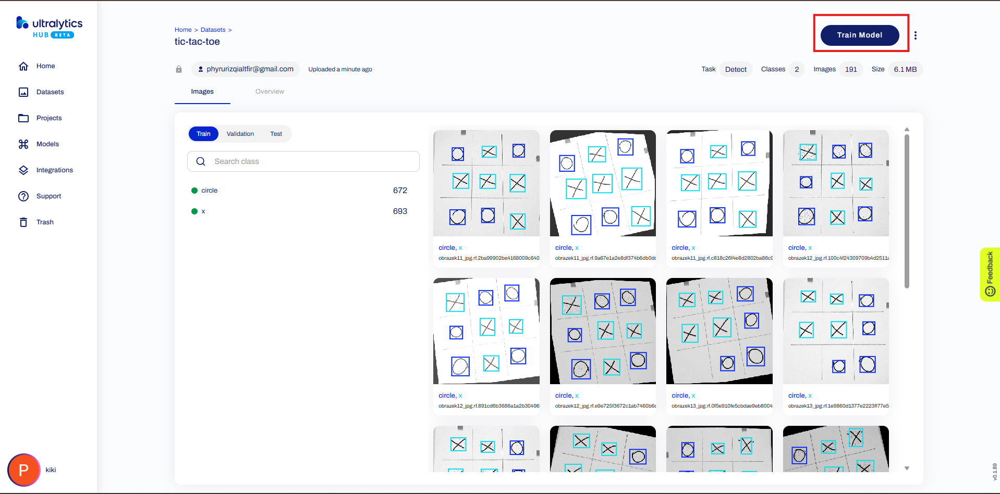

Untuk melatih model, tekan tombol "Train Model"

### 5. Pengaturan Model
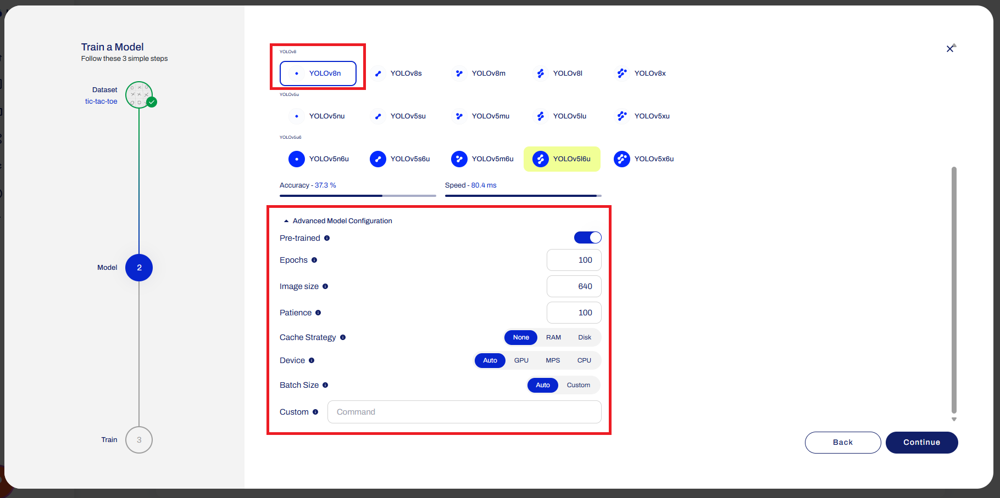

Sebelum model dilatih, perlu dilakukan beberpa pengaturan seperti memilih versi model yang digunakan dan beberapa pengaturan lanjut lainnya. Pengaturan model bisa dilakukan sama seperti pada gambar diatas atau menggunakan pengaturan yang lain. 

### 6. Pemilihan Tools untuk Train Model
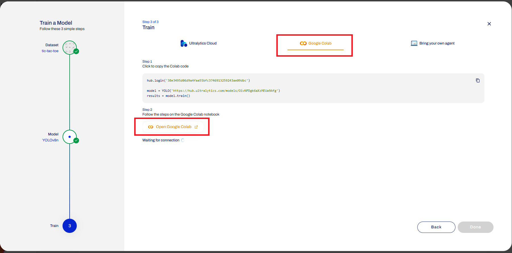

Untuk melatih model, bisa menggunakan Ultralytics CLoud, Google Collab, atau tools lainnya. Pada contoh kali ini akan menggunakan Google Collab. Untuk menggunakan Google Collab, pilih menu "Google Collab" dan tekan tombol "Open Google Collab".

Sebelum menekan tombol "Open Google Collab" pastikan sudah meng-copy kode program pada step 1.

### 7. Jalankan Google Collab
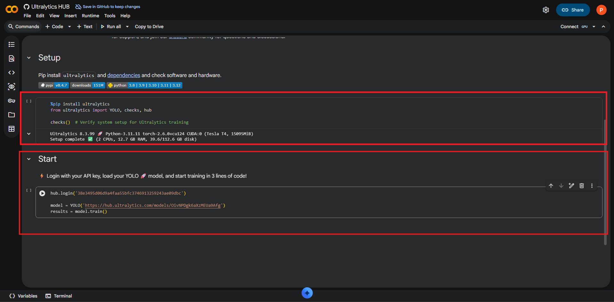

Setelah Google Collab terbuka, jalank kode pada bagian setup. Kode tersebut berfungsi untuk menginstall library-library yang akan digunakan. 

Setalah bagian setup selesai, paste kode yang sudah dicopy pada bagian start dan jalankan.

### 8. Google Collab Terhubung
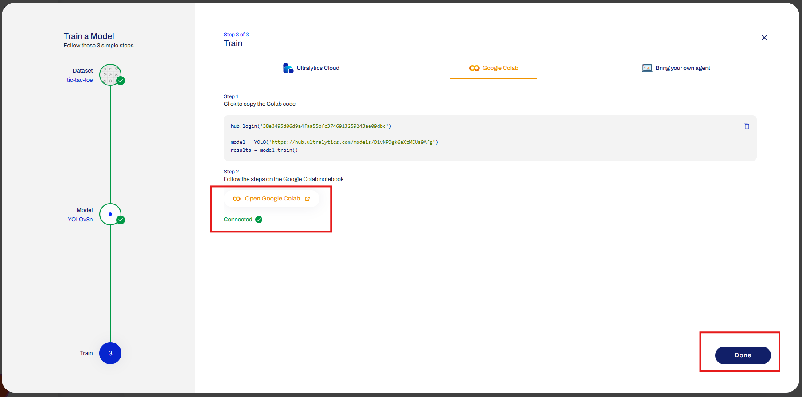

Setelah kode pada bagian start dijalankan, kembali ke web Ultralytics HUB. terlihat bahwa sekarang Google Collab sudah terhubung. Selanjutnya tekan tombol "Done".

## 9. Grafik Proses Training
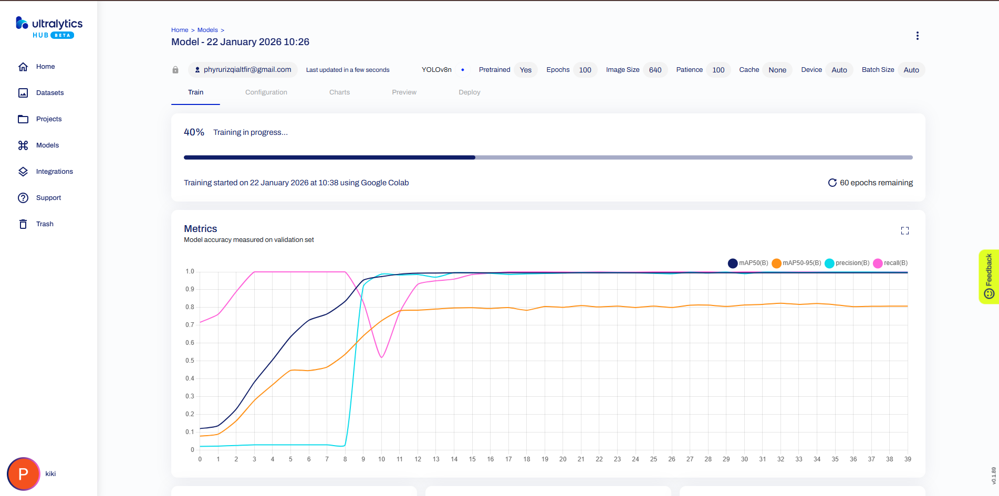

Setelah menekan tombol "Done", akan muncul Grafiik yang menunjukkan proses Training Model. Tunggu hingga proses training selesai.

## 10. Deploy
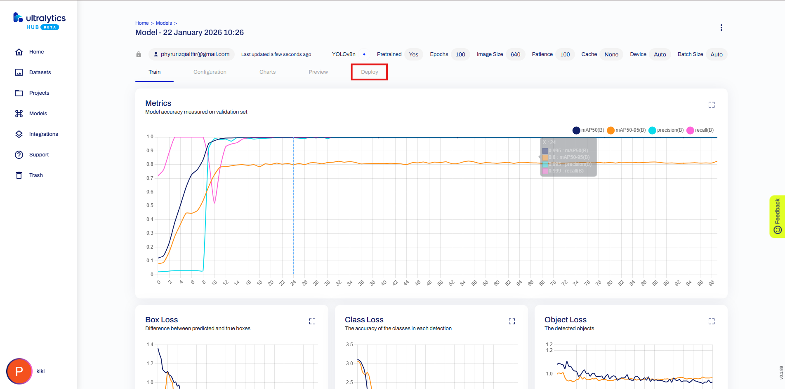

Setelah proses training selesai, dan grafik berhenti bergerak, pilih menu deploy untuk mendowload model.

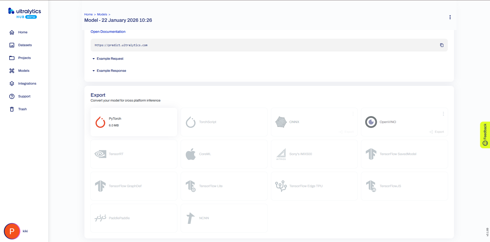

Model yang sudah ditraining bisa di export menjadi banyak tipe/format, seperti PyTorch, TensorFlow, NCNN, dll. Pada contoh ini akan menggunakan format PyTorch.


## 11. Test Model Dengan Google Collab
Untuk menguji model yang sudah dibuat berikut adalah langkah langkahnya.

1. Buat Notebook Baru dan Upload File
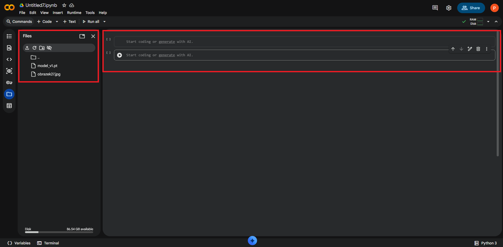

Buat Notebook baru dengan jumlah sel sebanyak 2. Lalu upload file model dan file gambar yang akan digunakan untuk menguji model.

2. Jalankan Kode Program

Jalankan kode berikut di sel pertama untuk menginstal library-library yang akan digunakan.

```python
    %pip install ultralytics
    from ultralytics import YOLO, checks, hub

    checks() 
```

Setelah kode program diatas selesai dijalankan pada sel pertama, jalan kode program ini pada sel kedua.

```python
    from ultralytics import YOLO
    from google.colab.patches import cv2_imshow

    # 1. Memanggil model yang ada di folder Files Anda
    model = YOLO('model_v1.pt') 

    # 2. Menjalankan prediksi pada gambar 'obrazek27.jpg'
    # conf=0.25 berarti model menampilkan deteksi dengan tingkat keyakinan minimal 25%
    results = model.predict(source='obrazek27.jpg', conf=0.25)

    # 3. Menampilkan visualisasi hasil deteksi
    for r in results:
        res_plotted = r.plot()
        cv2_imshow(res_plotted)
```

3. Hasil Pengujian


Setelah program pada sel kedua dijalankan, terlihat hasil object detection di dalam sel kedua.