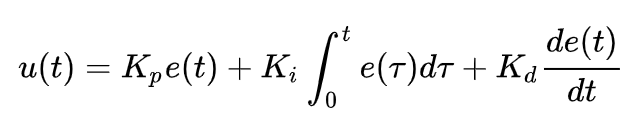

## Algorima PID

## Link Penting 🔗

* **Repository Github PID**
     * [Arduino-PID-Library](https://github.com/br3ttb/Arduino-PID-Library)
     * [Arduino-FOC](https://github.com/simplefoc/Arduino-FOC)

* **Video Youtube PID:**
    * [Pengenalan Sistem Kontrol PID Bagian 1](https://youtu.be/SZK5BvsQjX0?si=CIx5UTrpg4aZcN-7)
    * [Pengenalaan Sistem PID Bagian 2](https://youtu.be/c3nMN0EGsxM?si=FmpOoXi_JqUqaLIa)
    * [What is a PID Controller? | Digikey](https://youtu.be/tFVAaUcOm4I?si=lJfyjK0PIer2ZwmT)

* **Web Belajar:**
    * [Kontroller PID](https://www.kmtech.id/post/kontroller-pid-prinsip-kerja-aplikasinya-dalam-pengendalian-proses-keuntungan-kontroller-pid)
    * [PID (Proportional-Integral-Derivative) Controller](hhttps://putraekapermana.wordpress.com/2013/11/21/pid/)
    * [PID Tuning Guide](https://tlk-energy.de/blog-en/practical-pid-tuning-guide)
   
-----

## Apa itu Algoritma PID
PID adalah singkatan dari Proportional – Integral – Derivative, yaitu algoritma kontrol yang menghitung nilai keluaran (output) berdasarkan error (selisih antara nilai aktual/sensor dengan nilai yang diinginkan atau Setpoint).

## Komponen PID
Algoritma ini terdiri dari tiga komponen utama yang bekerja bersama, yaitu
* P (Proportional): Mengoreksi error saat ini. Semakin besar error, semakin kuat koreksinya.
* I (Integral): Mengakumulasi error dari waktu ke waktu. Gunanya untuk menghilangkan error kecil yang menetap yang tidak bisa diselesaikan oleh P saja.
* D (Derivative): Memprediksi error di masa depan berdasarkan tren saat ini. Ini berfungsi sebagai "rem" agar sistem tidak kebablasan (overshoot) saat mendekati setpoint.

## PID untuk MPU 9250
Sensor MPU 9250 memberikan data sudut (kemiringan). Jika robot miring ke depan 5 derajat, PID akan menghitung seberapa cepat motor harus berputar ke depan untuk mengembalikan robot ke posisi 0 derajat secara halus, tanpa membuat robot jatuh atau bergetar hebat. 

Pada kasus Robot Laba-laba dengan 4 kaki/lebih, penggunaan sensor MPU 9250 menjadi lebih kompleks karena robot ini memiliki bidang tumpu yang lebih luas dibandingkan robot dua roda. Meskipun memiliki 9-DOF, sudut Pitch, Roll, dan terkadang Yaw digunakan secara bersamaan sebagai input utama algoritma PID untuk menjaga stabilitas tubuh robot di medan yang tidak rata.

### 1. Peran Sudut Pitch dan Roll
* Pitch (Keseimbangan Depan-Belakang): Jika robot miring ke depan (misal karena mendaki), PID akan memerintahkan kaki depan untuk memanjang dan kaki belakang memendek agar tubuh tetap horizontal.
* Roll (Keseimbangan Kanan-Kiri): Jika robot miring ke samping saat melangkah, PID mendeteksi sudut Roll dan menyesuaikan tinggi kaki di sisi kiri dan kanan secara proporsional agar robot tidak terguling.

### 2. Penggunaan Yaw untuk Navigasi
Pada robot berkaki, Yaw (arah hadap) sering kali digunakan dalam algoritma PID untuk mengoreksi arah jalan.
* Saat melangkah, sering terjadi selisih gesekan antar kaki yang menyebabkan robot perlahan berbelok sendiri.
* Nilai Yaw dari Magnetometer/Gyroscope menjadi input bagi PID untuk menyesuaikan panjang langkah kaki kiri atau kanan agar robot tetap berjalan lurus sesuai target arah.

### 3. Implementasi dari PID ke Inverse Kinemarik
Pada robot laba-laba, output dari PID dikirim ke fungsi Inverse Kinematics.
* Input: Sudut error dari MPU (Pitch/Roll) masuk ke PID.
* Output PID: Menghasilkan nilai koreksi posisi x, y, z untuk koordinat tubuh robot.
* Eksekusi: Sistem Inverse Kinematik kemudian menghitung sudut derajat yang tepat bagi setiap motor Servo di semua kaki agar target posisi tubuh yang seimbang tersebut tercapai.

### 4. Menghindari Getaran pada Banyak Kaki
Karena robot laba-laba memiliki banyak aktuator (Servo), penggunaan komponen Derivative (Kd) sangat krusial. Tanpa Kd yang tepat, kaki-kaki robot akan bergerak terlalu kasar atau bergetar saat mencoba mengoreksi kemiringan, yang justru bisa merusak struktur mekanik robot.

## Proses PID unuk MPU 9 DoF
Proses penggunaan Pitch, Roll, dan Yaw sebagai input PID pada robot berkaki (seperti laba-laba) tidak dilakukan dalam satu rumus tunggal, melainkan melalui tiga jalur kontrol (Loop) yang bekerja secara paralel.

### 1. Pembagian Sumbu Kontrol
Setiap sumbu memiliki target (Setpoint) dan perhitungan PID-nya masing-masing.
* Jalur Pitch: Mengukur error kemiringan depan-belakang. Outputnya digunakan untuk mengatur ketinggian kaki depan vs kaki belakang.
* Jalur Roll: Mengukur error kemiringan kanan-kiri. Outputnya digunakan untuk mengatur ketinggian kaki sisi kanan vs sisi kiri.
* Jalur Yaw: Mengukur error arah hadap. Outputnya digunakan untuk menyesuaikan langkah kaki agar robot kembali ke arah yang benar.

### 2. Mekanisme Input ke Output
1. Sensor Fusion (Input Generation): Sembilan data mentah dari MPU 9250 digabung menggunakan Kalman atau Madgwick Filter untuk menghasilkan tiga angka sudut yang stabil yaitu Pitch, Roll, dan Yaw.
2. Perhitungan error untuk sudut pitch, roll, dan yaw.
3. Proses perhitungan PID untuk setiap sudut secara terpisah
4. Koordinasi Aktuator (Inverse Kinematics): Output dari ketiga PID tersebut (u(pitch), u(roll), u(yaw)) tidak langsung memutar servo, melainkan menjadi instruksi bagi algoritma Inverse Kinematics untuk mengubah posisi koordinat tubuh robot

### 3. Contoh Kasus: Robot Berada di Tanjakan Miring ke Kanan
Jika robot berada di medan yang miring ke depan (Pitch) sekaligus miring ke kanan (Roll):
* PID Pitch akan mendeteksi error dan memberikan output untuk memperpanjang kaki depan.
* PID Roll akan mendeteksi error dan memberikan output untuk memperpanjang kaki kanan.
* Hasil Akhirnya: Sistem koordinasi robot akan menggabungkan kedua perintah tersebut sehingga kaki depan-kanan akan menjadi yang paling panjang, sementara kaki belakang-kiri menjadi yang paling pendek, agar tubuh robot tetap rata (level).

## PID untuk Motor
Untuk Algoritma PID yang digunakan pada motor, bisa lihat ini:
* [DC Motor Control](https://youtube.com/playlist?list=PLhQSFP7_LypkRhYys1NaWir7tTO1cLVFy&si=jr47zwOWJg5BzKPo)

### Mengapa menggunakan PID untuk Mengontrol Motor?
Tanpa PID, motor cenderung tidak stabil saat menghadapi perubahan beban atau hambatan. PID digunakan karena:
* Presisi Tinggi: Memastikan motor mencapai kecepatan atau posisi target secara akurat meskipun ada gangguan eksternal.
* Respon Halus: Mencegah motor berputar secara mengejutkan atau kasar dengan memberikan percepatan dan pengereman yang terukur.
* Otomatisasi: Sistem dapat menyesuaikan diri sendiri tanpa perlu intervensi manual setiap kali beban motor berubah.

### Input pada Algoritma PID
Pada algoritma PID diperlukan beberapa nilai yang dijadikan sebagai input, yaitu
* Setpoint (Target): Nilai yang kita inginkan, misalnya kecepatan 100 RPM atau sudut 0 derajat.
* Nilai Aktual (Feedback): Data nyata dari sensor, seperti pembacaan Encoder untuk kecepatan motor atau MPU 9250 untuk kemiringan robot.
* Error (e): Selisih antara Setpoint dan Nilai Aktual (e = Setpoint - Nilai Aktual). Inilah yang menjadi nilai bagi PID untuk menghitung koreksi.

### Proses Algoritma PID untuk Motor
Setelah mendapatkan nilai Error, algoritma memprosesnya melalui tiga aksi secara paralel, yaitu
* Proportional (P): Memberikan tenaga dorong yang sebanding dengan besarnya error saat ini (Kp x e)
* Integral (I): Menjumlahkan error dari waktu ke waktu  untuk memastikan motor tidak berhenti sebelum target benar-benar tercapai.
* Derivative (D): Mengukur seberapa cepat error berubah untuk memprediksi masa depan dan berfungsi sebagai "rem" agar motor tidak melewati batas target (overshoot).
* Total Output (u(t)): Hasil dari ketiga perhitungan tersebut dijumlahkan untuk menjadi satu nilai instruksi akhir.

### Hasil Algoritma PID
Hasil akhir dari algoritma ini adalah sebuah sinyal kendali yang dikirim ke Motor Driver:
* Sinyal PWM: Nilai u(t) dikonversi menjadi lebar pulsa (PWM) biasanya antara 0 hingga 255 untuk menentukan kecepatan motor.
* Arah Putaran: Menentukan apakah motor harus berputar searah jarum jam atau sebaliknya berdasarkan tanda positif/negatif dari hasil PID.
* Stabilitas: Motor akan bergerak mendekati target dengan lintasan yang halus, minim getaran, dan mampu mempertahankan posisinya meskipun didorong atau diberi beban tambahan.

### Masalah yang mungkin terjadi
* Integral Windup (Limit Integrator): Jika roda robot tersangkut, error akan terus ada, dan bagian I pada rumus akan menjumlahkan error tersebut hingga nilainya mencapai ribuan. Saat hambatan dilepas, motor akan berputar sangat kencang. **Solusi: membatasi nilai maksimal yang boleh dihasilkan oleh bagian Integral dalam kode program.** 
* Deadband Motor: Motor fisik memiliki karakteristik di mana mereka tidak akan berputar jika diberi tegangan (PWM) yang terlalu rendah karena adanya gesekan internal. **Solusi: menambhakan nilai minimum PWM**

## Istilah Penting dalam PID
* Setpoint: Target nilai yang diinginkan (Contoh: Sudut 0 derajat).
* Input/Process Variable: Nilai yang terbaca sensor saat ini (Contoh: MPU membaca miring 10 derajat).
* Tuning: Proses mencari nilai konstanta Kp, Ki, dan Kd yang pas agar robot stabil.

## Rumus PID (Sederhana)
Rumus PID: 




* u(t) : Output kendali (misal: tegangan/PWM motor)
* e(t) : Error ouput pada waktu ke-t (e(t) = Setpoint - Nilai Sensor saat-t)
* Kp : Konstanta Proporsional, menentukan seberapa keras sistem bereaksi terhadap error saat ini.(nilainya ditentukan saat tunning)
* Ki : Konstanta Integrator, menjumlahkan error dari waktu ke waktu. Gunanya untuk memastikan u(t) benar-benar sampai ke titik target tanpa ada sisa error sedikitpun. (nilainya ditentukan saat tunning setelah Kp)
* Kd : Konstanta Derivative, mengukur seberapa cepat error berubah. Gunanya sebagai "peredam" atau rem otomatis agar u(t) melewati batas target (nilainya ditentukan saat tunning setelah Ki)
* dt : Selang waktu antar perhitungan. Ini sangat krusial dalam program karena integral dan derivative sangat bergantung pada ketepatan waktu.

### Diskritisasi untuk Pemrograman
Untuk diimplementasikan ke dalam kode mikrokontroler (seperti Arduino), rumus kalkulus di atas diubah menjadi bentuk diskrit:

| Komponen | Rumus Matematis | Implementasi Program |
|----------|-----------------|----------------------|
| **Proporsional** | $K_p \times e$ | `Kp * error` |
| **Integrator** | $K_i \int e \, dt$ | `Ki * (sum_error * dt)` |
| **Derivative** | $K_d \frac{de}{dt}$ | `Kd * (error - last_error) / dt` |

## Kode program PID Sederhana

```cpp
    #include <util/atomic.h> // Untuk keamanan pembacaan variabel encoder

    // Pin Motor & Encoder
    const int pinPWM = 9;
    const int pinDir = 8;
    const int pinEncoderA = 2; // Pin interrupt

    // Variabel Encoder
    volatile long encoderPos = 0; 
    long lastPos = 0;

    // Variabel PID
    double setpoint = 50.0; // Target: 50 pulsa per interval
    double input = 0; // Kecepatan aktual dari sensor
    double output = 0; // Hasil perhitungan PID untuk PWM
    double error = 0, lastError = 0;
    double integral = 0, derivative = 0;

    // Konstanta PID (Mulai dari Kp saja dulu saat tuning)
    double Kp = 1.5; 
    double Ki = 0.5; 
    double Kd = 0.1; 

    unsigned long lastTime = 0;

    void setup() {
        Serial.begin(9600);
        pinMode(pinEncoderA, INPUT_PULLUP);
        attachInterrupt(digitalPinToInterrupt(pinEncoderA), countEncoder, RISING);
        
        pinMode(pinPWM, OUTPUT);
        pinMode(pinDir, OUTPUT);
        lastTime = millis();
    }

    void loop() {
        // Pre-processing: Hitung selang waktu (dt)
        unsigned long currentTime = millis();
        double dt = (double)(currentTime - lastTime) / 1000.0; // Ubah ke detik

        if (dt >= 0.05) { // Hitung setiap 50ms
            // Baca posisi encoder secara aman
            long currentPos;
                ATOMIC_BLOCK(ATOMIC_RESTORESTATE) {
                currentPos = encoderPos;
            }

            // Input adalah selisih posisi (kecepatan)
            input = (currentPos - lastPos); 
            lastPos = currentPos;

            // Hitung PID
            error = setpoint - input; // Hitung error
            integral += error * dt;   // Hitung Integral
            integral = constrain(integral, -100, 100); // // Tambahkan batas integral (Anti-Windup)
            derivative = (error - lastError) / dt; // Hitung derivative

            output = (Kp * error) + (Ki * integral) + (Kd * derivative); // Hitung total Ouput u(t)

            // Kirim ke Driver Motor (L298N dll)
            driveMotor(output);

            lastError = error;
            lastTime = currentTime;

            // Tampilkan di Serial Plotter untuk Tuning
            Serial.print(setpoint); Serial.print(" ");
            Serial.println(input);
        }
    }

    void countEncoder() {
        encoderPos++;
    }

    void driveMotor(double pwm) {
        int speed = constrain(abs(pwm), 0, 255);
        digitalWrite(pinDir, pwm > 0 ? HIGH : LOW);
        analogWrite(pinPWM, speed);
    }
```

## Tuning PID
Sumber: 
* [How to Tune a PID COntroller for an Inverted Pendulum | Digikey](https://youtu.be/hRnofMxEf3Q?si=CoE0QymsUkQEJXRM)
 * [PID Tuning Guide](https://tlk-energy.de/blog-en/practical-pid-tuning-guide)

 Tuning PID adalah proses yang dilakukan untuk menemukan nilai konstanta Kp, Ki, dan Kd yang paling optimal agar sistem (seperti motor atau robot) dapat merespon targete dengan cepat, akurat, dan stabil.

 ### Tujuan Tuning
 * Mendapatkan Respon Cepat: Mengatur seberapa cepat sistem mencapai nilai setpoint yang diinginkan.
 * Menghilangkan Error Sisa: Memastikan sistem tidak berhenti sebelum benar-benar mencapai target (steady-state error).
 * Mencapai Stabilitas: Mencegah sistem bergoyang (osilasi) secara berlebihan atau menjadi tidak terkendali.

 ### Tahapan Tuning
 1. Persiapan Awal
    * Periksa Arah Gain : Sebelum memutar nilai apa pun, pastikan tanda (sign) dari kontroler sudah benar. Jika respon sistem terbalik (umpan balik positif), sistem akan langsung menjadi tidak stabil.
    * Setel konstanta integral (Ki) dan derivative (Kd) ke angkan 0 sehingga kontroler bekerja hanya denga Proporsional kontroler saja.
 2. Tunning Proporsional (Kp)
    * Mulai dari Nilai Rendah: Berikan nilai tebakan awal yang kecil untuk Kp.
    * Tingkatkan Secara Bertahap: Naikkan Kp sedikit demi sedikit sambil memberikan perintah perubahan target (step response).
    * Cari Titik Osilasi: Terus naikkan Kp hingga sistem mulai mendekati target dengan cepat, meskipun mungkin masih ada guncangan atau osilasi. Jika sistem bergoyang tanpa henti atau menjadi liar, berarti Kp terlalu tinggi.
    * Proporsional-kontroler murni hampir selalu menyisakan steady-state error (target tidak pernah tercapai tepat 100%).
 3. Tuning Integral (Ki)
    * Masukkan nilai Ki yang sangat kecil untuk menghilangkan selisih target yang tersisa tadi
    * Atur Kecepatan: Naikkan Ki hingga sistem mampu mencapai target tepat di titik nol
    * Jika Ki terlalu besar, sistem akan bergoyang dengan amplitudo yang makin membesar (tidak stabil)
 4. Tuning Derivative (Kd)
    *  Gunakan Kd untuk mengurangi lonjakan berlebih (overshoot) yang muncul saat sistem mengejar target.
    Berikan Redaman: Naikkan Kd secara perlahan untuk "menenangkan" gerakan sistem agar tidak terlalu liar saat mendekati target.
    Batas Maksimal: Jangan memberikan Kd terlalu tinggi karena dapat menyebabkan sistem menjadi sangat sensitif terhadap gangguan kecil (noise) atau justru bergetar kasar.